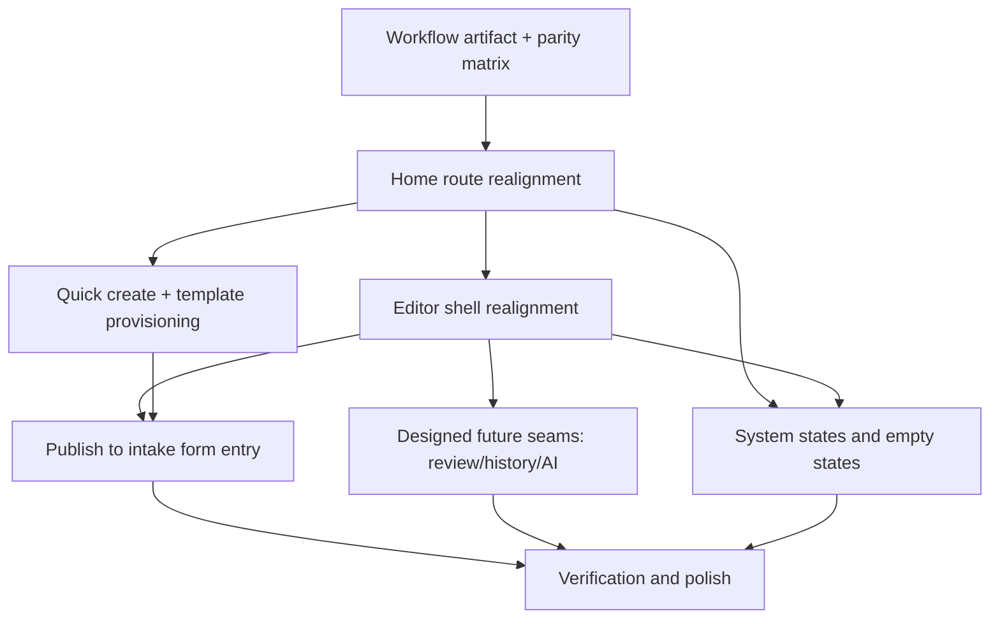

# feat: Tencent-Compat Bankruptcy Claims Collaboration MVP

## Overview

Refocus the current graph-spreadsheet MVP into a Tencent Docs-compatible bankruptcy claims collaboration product. The implementation is not a greenfield build: the repo already has workbook routing, OIDC auth, Univer bootstrap, SurrealDB connectivity, intake forms, admin tooling, and collaboration primitives. The work is to reshape those pieces around the approved two-page product model so the primary path feels immediately familiar to Tencent Docs users while preserving the controlled data model, sheet-to-form workflow, and future seams for review, history, rollback, and AI.

## Problem Frame

The approved design defines a narrow but complete migration loop for bankruptcy administrator teams: a Tencent-compatible home, a Tencent-compatible editor, sheet-to-form publishing, and trustworthy system-state handling. The current repo proves many technical seams, but the shipped surface still reflects the earlier graph-workbook posture: template-first language, mixed mock/real data, and domain features that are present but not yet composed into a coherent Tencent-compatible workflow. This plan closes that gap without expanding scope into real review queues, full history, or AI behavior.

The design also introduces one non-code gate: before claiming the Tencent-compatible 20-30% interaction set is locked, the team needs a concrete workflow artifact from a real bankruptcy administrator team. That artifact is a planning dependency for parity decisions, not a reason to block all shell implementation.

## Requirements Trace

- R1. Home route reads as a Tencent Docs-compatible document home with search-first header, left rail, quick create, and dense recent-workbook list.
- R2. Editor route preserves Tencent-compatible spreadsheet familiarity for the first three seconds: title, toolbar rhythm, sheet-first layout, and subordinate right dock.
- R3. The MVP keeps one real migration loop intact: workbook data can publish to a public creditor intake form and route submissions back into the same controlled workspace narrative.
- R4. Reconnect, auth-failed, permission-failed, deleted-sheet, empty, and partial-loading states are explicit, designed, and consistent with the design system.
- R5. Review, history, and AI are visible as intentional future seams from day one, but remain placeholder-only in MVP.
- R6. Existing SurrealDB schema and routing choices preserve future auditability, rollback, graph traversal, and domain plugin expansion without re-platforming.
- R7. Implementation reuses the repo's current route, shell, auth, Univer, form, and schema primitives rather than replacing them.
- R8. A workflow artifact and parity matrix define which Tencent Docs interactions belong in the first compatible 20-30% and which are deferred.

## Scope Boundaries

- No real multi-person review queue behavior in this phase.
- No real history browser or rollback UI in this phase.
- No AI analysis or copilot behavior in this phase.
- No phone spreadsheet editing parity beyond view-first/read-first behavior.
- No full Tencent Docs clone; only the approved home/editor habits and the bankruptcy-claims wedge.
- No replacement of direct SurrealDB-from-SPA architecture unless implementation uncovers a blocking security or feasibility defect.

## Dependencies / Prerequisites

- A real bankruptcy-administrator workflow artifact is required before the team can claim the Tencent-compatible 20-30% interaction set is finalized.
- Existing direct SurrealDB access, OIDC login, Univer embedding, and template provisioning remain hard dependencies for this phase; the plan assumes they are refined, not replaced.
- Visual implementation must continue to follow `DESIGN.md` exactly unless an explicit design decision is recorded.

## Context & Research

### Relevant Code and Patterns

- `src/app/router.tsx` already models the core route split: `/workbooks`, `/workbooks/$workbookId`, `/templates`, `/admin`, and `/callback`.
- `src/features/workbook/app-shell.tsx` already contains the main page composition seam for the two-page product, including workbook mode, template mode, reconnect banner, and side drawer behavior.
- `src/workbook/univer.ts` and `src/workbook/univer-header.tsx` already own the Tencent-like editor shell extension points: workbook switcher, account/share controls, ribbon entries, and side-panel hooks.
- `src/features/workbook/use-workspace.ts` and `src/features/workbook/use-sheets.ts` already follow the required SurrealDB pattern: permissions live in schema, while client queries only fetch user-visible data.
- `src/forms/intake-form.tsx` and `src/forms/confirmation.tsx` already provide the public intake flow, draft persistence, transactional submission, and confirmation screen needed for the sheet-to-form loop.
- `src/shell/template-provisioning.ts` already encapsulates template provisioning and compensating cleanup, which should back the "quick create" and legal-workflow-first creation flows instead of mock-only branching.
- `src/lib/surreal/ddl.ts` centralizes dynamic table DDL and correctly keeps permissions in schema rather than leaking authorization logic into queries.
- Existing test coverage is colocated with implementation and should remain the default pattern for new plan work: `src/features/workbook/app-shell.test.tsx`, `src/features/auth/auth.test.ts`, `src/forms/intake-form.test.ts`, `src/forms/intake-form-submission.test.ts`, `src/admin/admin-sidebar.test.tsx`, `src/workbook/collaboration.test.ts`, `src/lib/surreal/client.test.ts`.

### Institutional Learnings

- `docs/solutions/best-practices/surrealdb-sheet-as-table-schema-design-2026-04-06.md` establishes that `snapshot` stores layout only, business values live in entity tables, and `edge_catalog` must use physical table names. That directly constrains this plan: Tencent-compatible shell work must not regress the existing sheet-as-table and future graph/audit seams under the hood.

### External References

- None required for the current planning pass. The codebase already has direct patterns for routing, auth, workbook composition, forms, SurrealDB permissions, and Univer integration, so local patterns are stronger than generic external guidance for this feature.

## Key Technical Decisions

- **Treat this as a product-surface refocus, not a backend rewrite.** The approved design changes the primary UX shape and language more than the core architecture, so the plan keeps the current direct SPA-to-SurrealDB model and real-time workbook primitives intact.
- **Collapse mock-first entry paths behind real workspace/workbook data.** The current repo still carries `src/features/workbook/mock-data.ts` as a top-level behavior driver. The compatible home/create flow should instead pivot around `useWorkspace`, real workbook summaries, and template provisioning so the product story is consistent from first click through editor entry.
- **Preserve a two-page mental model.** `/workbooks` and `/workbooks/$workbookId` become the authoritative home/editor pair, while `/templates` and `/admin` should feel subordinate rather than primary destinations.
- **Keep Tencent familiarity on the outer shell; keep domain power in progressive surfaces.** Editor differentiation belongs in top actions, dock tabs, create flows, and placeholder panels, not in a dashboard-style replacement of the spreadsheet.
- **Ship placeholder seams intentionally.** Review, history, and AI remain visible and designed because the product promise includes those future capabilities, but the implementation must clearly distinguish placeholder surfaces from live workflows.
- **Add a parity-definition artifact before locking behavioral fidelity.** UI implementation can proceed, but a repo-tracked workflow artifact and parity matrix are required before the team declares the Tencent-compatible 20-30% interaction set final.

## Open Questions

### Resolved During Planning

- **Should this plan replace the existing 2026-04-05 graph-spreadsheet MVP plan?** No. The prior plan remains the broader architecture baseline; this plan is the narrower, later-approved product-surface plan that reorients implementation around Tencent-compatible bankruptcy claims collaboration.
- **Should the public form become an in-editor mode rather than a separate route?** Not in MVP. Keep the separate public route, but integrate it narratively into the editor/home surfaces through publish entry points, confirmation copy, and placeholders that make it feel like one workflow.
- **Does the repo have enough local patterns to skip external research?** Yes. Router, auth, workbook shell, intake form, template provisioning, and SurrealDB schema patterns already exist locally.

### Deferred to Implementation

- **Exact Tencent Docs parity target list.** Requires the workflow artifact and parity matrix from real users; implementation should leave room for refinement but not invent fidelity claims.
- **Brand/legal similarity boundary.** The design asks the question, but this is a product/legal decision rather than a code-level planning blocker. The implementation should follow "compatible familiarity" language and avoid brand-specific assets or direct Tencent trademark mimicry.
- **Minimum trustworthy review/audit surface before live team rollout.** MVP keeps placeholders and schema seams; production readiness still depends on later product validation.

## High-Level Technical Design

> *This illustrates the intended approach and is directional guidance for review, not implementation specification. The implementing agent should treat it as context, not code to reproduce.*

The solution shape is to preserve the current architectural spine while reordering the product surface around one document-home route and one spreadsheet-editor route. Existing domain systems remain underneath that shell, but user-facing hierarchy changes so the spreadsheet is primary, domain actions are progressive, and all unfinished areas still look intentional.

## Implementation Units

- [x] **Unit 1: Capture workflow artifact and Tencent-compat parity matrix**

**Goal:** Produce the prerequisite artifact that documents the real bankruptcy-claims workflow, then translate it into an explicit compatibility matrix for the first 20-30% of Tencent Docs behaviors the MVP will honor.

**Requirements:** R8

**Dependencies:** None

**Files:**
- Create: `docs/brainstorms/2026-04-10-bankruptcy-claims-workflow-artifact.md`
- Create: `docs/plans/attachments/2026-04-10-tencent-compat-parity-matrix.md`

**Approach:**
- Record the actual operational path the design calls out: intake, review, number-checking, disagreement points, version-drift points, and daily relied-on Tencent behaviors.
- Convert that artifact into a parity matrix with three buckets: must match in MVP, may approximate in MVP, and explicitly deferred.
- Use the matrix to constrain later implementation units so shell polish does not drift into unvalidated imitation or feature creep.

**Patterns to follow:**
- `DESIGN.md` for familiarity-first framing and scope restraint.
- Existing plan style in `docs/plans/2026-04-05-001-feat-graph-spreadsheet-mvp-plan.md` for repo planning conventions.

**Test scenarios:**
- Test expectation: none -- documentation-only prerequisite artifact.

**Verification:**
- The artifact answers all six prerequisite questions from the approved design.
- The parity matrix names the concrete home/editor behaviors the team will preserve in MVP and the behaviors intentionally deferred.

- [x] **Unit 2: Realign home route into Tencent-compatible document home**

**Goal:** Turn the current template-first surface into the approved Tencent-compatible home page backed by real workspace and workbook data.

**Requirements:** R1, R7, R8

**Dependencies:** Unit 1 for parity choices; existing workspace/workbook data must remain the source of truth.

**Files:**
- Modify: `src/app/router.tsx`
- Modify: `src/features/workbook/app-shell.tsx`
- Modify: `src/features/workbook/use-workspace.ts`
- Modify: `src/features/workbook/mock-data.ts`
- Modify: `src/styles/global.css`
- Test: `src/features/workbook/app-shell.test.tsx`

**Approach:**
- Make `/workbooks` the canonical document home with search-first header, quick-create entry, dense recent workbook list, and subtle trust cues.
- Reduce `mock-data` to placeholder content only where a real data source does not yet exist; remove it as the behavioral driver for the main home state.
- Promote real workbook metadata from `useWorkspace` into the list surface, including last-opened/updated language and workspace trust cues.
- Ensure the home surface still degrades cleanly for first-run, no-workbook, and no-access states without collapsing into a dashboard.

**Patterns to follow:**
- `src/features/workbook/use-workspace.ts` for permission-safe workspace loading.
- `src/features/workbook/app-shell.tsx` for split home/editor composition.
- `DESIGN.md` Home Page Rules and component density rules.

**Test scenarios:**
- Happy path: authenticated user with multiple workbooks opens `/workbooks` and sees a dense recent-workbook list with search and quick-create affordances.
- Happy path: selecting a workbook row navigates to `/workbooks/$workbookId` without a visual mode change that feels like a different product.
- Edge case: authenticated user with no workbooks sees the same home skeleton plus one clear next action rather than a blank dashboard.
- Error path: workspace load failure shows a stable shell with clear explanation and recovery action.
- Integration: home view reads workbook summaries from real `useWorkspace` data rather than mock seed defaults.

**Verification:**
- The home route feels list-first and Tencent-compatible on desktop.
- Mock data no longer controls the primary home behavior.
- Existing tests cover the home route contract and are updated for the new structure/copy.

- [x] **Unit 3: Realign editor shell into Tencent-compatible sheet-first workspace**

**Goal:** Make the workbook route feel like a familiar Tencent Docs editor on first impression while keeping domain panels and real-time workbook plumbing intact.

**Requirements:** R2, R5, R6, R7

**Dependencies:** Unit 2

**Files:**
- Modify: `src/features/workbook/app-shell.tsx`
- Modify: `src/workbook/univer.ts`
- Modify: `src/workbook/univer-header.tsx`
- Modify: `src/sidebar/graph-results.tsx`
- Modify: `src/sidebar/recent-changes.tsx`
- Modify: `src/admin/admin-sidebar.tsx`
- Modify: `src/styles/global.css`
- Test: `src/features/workbook/app-shell.test.tsx`

**Approach:**
- Preserve Univer as the editor core, but rebalance the shell so the grid, workbook title, toolbar rhythm, sheet tabs, share control, and account control match the approved familiarity-first hierarchy.
- Reposition dock/panel affordances as subordinate utilities with clearer labels for review/history/AI-ready expansion.
- Keep graph/admin capabilities available, but ensure they read as workspace tools layered onto a spreadsheet rather than the spreadsheet's replacement.
- Normalize panel copy and headings so placeholders feel intentional and product-aligned instead of generic scaffolding.

**Technical design:** *(directional guidance, not implementation specification)*

| Surface | MVP behavior | Deferred behavior |
|---|---|---|
| Grid | Always primary | None |
| Right dock | Intentional panels for review/history/AI/admin | Real workflows behind review/history/AI |
| Header actions | Share/account/workbook identity | Rich collaboration menus |
| Ribbon/tools | Familiar spreadsheet rhythm plus publish/workspace entries | Full Tencent Docs parity |

**Patterns to follow:**
- `src/workbook/univer.ts` extension hooks for ribbon and header composition.
- `src/workbook/univer-header.tsx` for lightweight custom header parts.
- `DESIGN.md` Editor Page Rules and right-dock hierarchy.

**Test scenarios:**
- Happy path: opening `/workbooks/$workbookId` renders the spreadsheet canvas as the clear primary surface.
- Happy path: share/account/workbook switcher controls remain available without displacing the sheet.
- Edge case: opening a dock panel does not hide or structurally replace the editor shell.
- Integration: workbook switch from the editor preserves route state and remounts the active workbook cleanly.
- Integration: placeholder panels for review/history/AI render as designed future seams rather than empty generic cards.

**Verification:**
- The first-use editor impression is spreadsheet-first and Tencent-compatible.
- Existing graph/admin/recent-changes tools remain reachable through the shell.
- Tests and manual review confirm no visual cliff between home and editor routes.

- [x] **Unit 4: Integrate quick create, template provisioning, and sheet-to-form publishing into one bankruptcy-claims workflow**

**Goal:** Connect creation and intake flows into a coherent legal-operations narrative instead of leaving them as isolated technical features.

**Requirements:** R3, R6, R7

**Dependencies:** Units 2 and 3

**Files:**
- Modify: `src/app/router.tsx`
- Modify: `src/features/workbook/app-shell.tsx`
- Modify: `src/shell/template-provisioning.ts`
- Modify: `src/forms/intake-form.tsx`
- Modify: `src/forms/confirmation.tsx`
- Modify: `src/admin/form-builder.tsx`
- Modify: `src/styles/global.css`
- Create: `src/app/router.test.tsx`
- Create: `src/shell/template-provisioning.test.ts`
- Test: `src/forms/intake-form.test.ts`
- Test: `src/forms/intake-form-submission.test.ts`

**Approach:**
- Reframe quick-create actions around legal workflow starts: create creditor workbook, publish submission form, import creditor ledger.
- Use existing template provisioning instead of mock-only template selection so first-run and create flows produce real workspace/workbook outcomes.
- Surface a publish-to-form action from the workbook context and connect it to the existing public intake route and confirmation view.
- Keep the public route separate, but use consistent copy and state transitions so it feels like an extension of the same controlled workspace.

**Patterns to follow:**
- `src/shell/template-provisioning.ts` for DDL-first/DML-second template creation.
- `src/forms/intake-form.tsx` for draft persistence, transactional submission, and file handling.
- `src/forms/confirmation.tsx` for full-page post-submit confirmation.

**Test scenarios:**
- Happy path: quick-create action provisions a workbook from a legal template and routes the user into the new workbook.
- Happy path: workbook publish entry exposes the public intake flow and submission confirmation without losing workspace context in copy and labels.
- Edge case: provisioning failure reports the failed step and leaves no half-created visible workflow entry.
- Error path: form load or submit failure keeps the page usable with explicit error messaging.
- Integration: successful public submission still uses the transactional `buildSubmissionTransaction` path and remains compatible with live workbook data ingestion.
- Integration: route-level tests prove that home create actions, workbook navigation, and public form entry compose correctly through the real router rather than only through isolated callback props.

**Verification:**
- A user can move from home create flow to workbook to public intake publishing without encountering mock-only branches.
- Form flows remain fully usable on phone-sized layouts.
- Existing form tests still pass and cover new workflow-facing copy/entry points.

- [x] **Unit 5: Design and implement explicit system states for trust and recovery**

**Goal:** Make all required reconnect, auth, permission, deleted-resource, empty, and partial-loading states explicit and visually consistent with the design system.

**Requirements:** R4, R7

**Dependencies:** Units 2 and 3

**Files:**
- Modify: `src/features/workbook/app-shell.tsx`
- Modify: `src/features/auth/auth.ts`
- Modify: `src/lib/surreal/client.ts`
- Modify: `src/features/workbook/use-sheets.ts`
- Modify: `src/features/workbook/use-workspace.ts`
- Modify: `src/styles/global.css`
- Test: `src/features/workbook/app-shell.test.tsx`
- Test: `src/features/auth/auth.test.ts`
- Test: `src/lib/surreal/client.test.ts`

**Approach:**
- Standardize state rendering across home, editor, and public-flow surfaces so the user sees calm, serious, recovery-oriented messaging.
- Differentiate auth-failed from reconnecting/disconnected from permission/resource errors; do not collapse them into a generic toast or missing-data blank.
- Add explicit deleted-sheet and partial-loading handling paths where hooks currently assume either success or total failure.
- Keep live-region/accessibility behavior in sync with these transitions, especially for reconnect and auth restoration.

**Patterns to follow:**
- `src/features/auth/auth.ts` for callback restoration and login state.
- `src/lib/surreal/client.ts` for connection state subscriptions.
- Existing reconnect banner handling in `src/features/workbook/app-shell.tsx`.

**Test scenarios:**
- Happy path: temporary reconnect shows live status and recovers back to connected state without disorienting the user.
- Error path: auth failure renders the dedicated sign-in recovery surface and preserves route restoration behavior after re-authentication.
- Error path: permission failure on workspace or workbook access renders a stable explanation instead of an empty list or silent redirect.
- Error path: deleted or missing sheet/workbook renders a controlled recovery state with a clear navigation path back home.
- Integration: connection-state and auth-state transitions remain reflected in the UI through the existing external-store subscriptions.

**Verification:**
- All required states from the design document exist in the plan's target routes/components.
- State copy and visual treatment match the calm/trustworthy design posture.
- Tests cover the new state branches instead of only happy-path rendering.

- [x] **Unit 6: Preserve future seams and align underlying schema-driven behavior with the new product surface**

**Goal:** Ensure the Tencent-compatible surface does not regress the project’s structured-data, permissions, collaboration, and future plugin foundations.

**Requirements:** R5, R6, R7

**Dependencies:** Units 3, 4, and 5

**Files:**
- Modify: `src/lib/surreal/ddl.ts`
- Modify: `src/admin/admin-sidebar.tsx`
- Modify: `src/admin/entity-types.tsx`
- Modify: `src/admin/relation-types.tsx`
- Modify: `src/workbook/collaboration.ts`
- Modify: `src/workbook/snapshot.ts`
- Modify: `src/workbook/presence.ts`
- Test: `src/admin/admin-sidebar.test.tsx`
- Test: `src/workbook/collaboration.test.ts`

**Approach:**
- Audit the current schema/admin/workbook seams against the approved product surface and keep the ones needed for future review/history/rollback/AI expansion.
- Remove surface-language drift that still frames the app as a generic graph workbook when the approved product is bankruptcy-claims collaboration.
- Keep permissions schema-centric and workspace-scoped, following existing SurrealDB patterns and the documented sheet-as-table learning.
- Verify that placeholder panels and admin actions do not require a later architectural pivot to support review/history/audit.

**Patterns to follow:**
- `docs/solutions/best-practices/surrealdb-sheet-as-table-schema-design-2026-04-06.md`
- `src/lib/surreal/ddl.ts` for schema-owned permissions and table naming.
- `src/workbook/collaboration.ts`, `src/workbook/snapshot.ts`, and `src/workbook/presence.ts` for existing real-time foundations.

**Test scenarios:**
- Happy path: admin surfaces still manage entity/relation/form/member definitions after shell realignment.
- Edge case: renamed surface copy does not break assumptions about underlying table keys or workspace-scoped DDL generation.
- Integration: collaboration/snapshot logic remains workbook-scoped and unaffected by home/editor route refocus.
- Integration: schema-driven permissions remain enforced through table definitions rather than new client-side filtering.

**Verification:**
- No implementation unit above forces a re-platform of SurrealDB schema, collaboration, or plugin seams.
- Admin and collaboration tests still validate the structural behavior that future review/history/AI work will rely on.

- [x] **Unit 7: Final UX verification and regression hardening**

**Goal:** Validate that the product now reads as a Tencent-compatible bankruptcy claims tool instead of a graph-workbook demo, and close the remaining route/test/documentation gaps.

**Requirements:** R1, R2, R3, R4, R5, R6, R7, R8

**Dependencies:** Units 1 through 6

**Files:**
- Modify: `docs/plans/2026-04-10-001-feat-tencent-compat-bankruptcy-claims-plan.md`
- Modify: `DESIGN.md`
- Modify: `src/features/workbook/app-shell.test.tsx`
- Modify: `src/forms/intake-form.test.ts`
- Modify: `src/features/auth/auth.test.ts`
- Modify: `src/lib/surreal/client.test.ts`

**Approach:**
- Run a final gap pass against the workflow artifact, parity matrix, and design thesis.
- Tighten tests where route transitions, shell hierarchy, or state messaging changed during implementation.
- Record any consciously deferred parity items so they do not get rediscovered as ambiguous bugs later.

**Patterns to follow:**
- Colocated Vitest style already used across `src/`.
- `DESIGN.md` decision log pattern for recording any approved visual or hierarchy clarifications.

**Test scenarios:**
- Happy path: home -> workbook -> publish form -> confirmation reads as one coherent product journey.
- Integration: template provisioning, route navigation, auth restoration, and reconnect messaging still compose cleanly after the refactor.
- Edge case: no-workbook, missing-workbook, and panel-placeholder states preserve the same design language as the primary path.
- Error path: regression suite catches copy/structure drift back toward dashboard-first or mock-first behavior.

**Verification:**
- The implemented product matches the approved design thesis: clone the outer habit, differentiate in the inner machinery.
- Deferred items are documented, not hidden.
- The regression suite covers the newly critical route and state contracts.

## System-Wide Impact

- **Interaction graph:** Changes touch the main route tree, workspace/workbook loading hooks, Univer shell composition, template provisioning, public form flow, and connection/auth state surfaces.
- **Error propagation:** Auth and connection failures must continue flowing through `auth.ts` and `client.ts` into route-level UI states rather than being handled ad hoc inside leaf components.
- **State lifecycle risks:** Moving from mock-driven behavior to real provisioning/loading raises risks around empty states, partially created workbooks, and stale route assumptions after create/delete transitions.
- **API surface parity:** Home/editor/public-form routes must remain coherent across desktop and phone-safe public form usage; no new standalone dashboard or workbench route should appear.
- **Integration coverage:** The most important verification spans router + auth + workspace loading + workbook shell + public form flow, because unit-level component tests alone will not prove the Tencent-compatible journey.
- **Unchanged invariants:** Direct SPA-to-SurrealDB architecture, schema-owned permissions, sheet-as-table storage, real-time collaboration primitives, and the public intake submission transaction contract remain intact.

## Risks & Dependencies

| Risk | Mitigation |
|------|------------|
| Design parity decisions drift without real user workflow evidence | Land Unit 1 first and treat the parity matrix as a gate for fidelity claims |
| Shell polish hides underlying real/mock inconsistency | Replace mock-driven primary behavior with `useWorkspace` + template provisioning before broad UI polish |
| Tencent-compatible surface accidentally becomes a legal dashboard | Keep `/workbooks` list-first and `/workbooks/$workbookId` sheet-first; reject panel-first layouts |
| State handling stays incomplete because existing code assumes happy paths | Dedicate Unit 5 to explicit state branches with test coverage |
| Surface refocus breaks collaboration/admin fundamentals | Preserve schema/collab/admin tests and audit affected seams in Unit 6 |
| Legal/trademark similarity concerns emerge late | Use "compatible familiarity" rather than direct brand mimicry; keep this as an explicit product/legal review item, not an accidental implementation detail |

## Documentation / Operational Notes

- The workflow artifact and parity matrix should be treated as required inputs for future design review, QA, and product validation.
- If implementation materially refines Tencent-compat hierarchy or bankruptcy-specific language, update `DESIGN.md` decision log so later UI work does not regress toward the earlier graph-workbook posture.
- If production rollout is attempted before real review/history/audit surfaces exist, product messaging must clearly frame those areas as planned expansions rather than implied live capabilities.

## Sources & References

- Related plan: `docs/plans/2026-04-05-001-feat-graph-spreadsheet-mvp-plan.md`
- Design system: `DESIGN.md`
- SurrealDB schema learning: `docs/solutions/best-practices/surrealdb-sheet-as-table-schema-design-2026-04-06.md`
- Related code: `src/app/router.tsx`
- Related code: `src/features/workbook/app-shell.tsx`
- Related code: `src/workbook/univer.ts`
- Related code: `src/forms/intake-form.tsx`
- Related code: `src/features/auth/auth.ts`
- Origin input: approved external design artifact "Tencent-Compat Bankruptcy Claims Collaboration System" dated 2026-04-10
