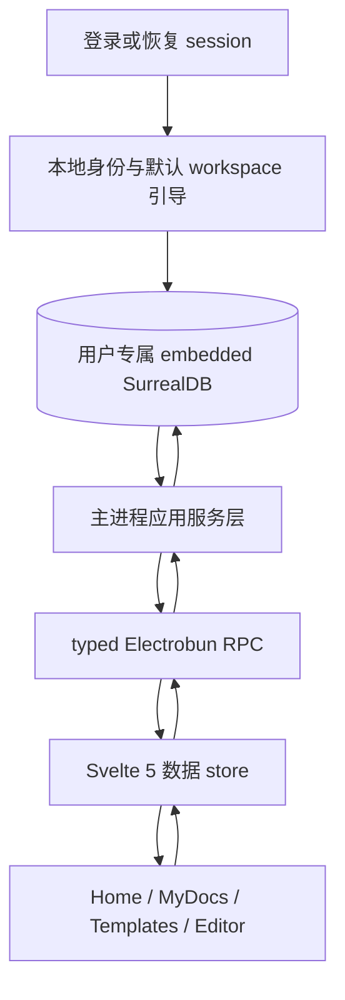
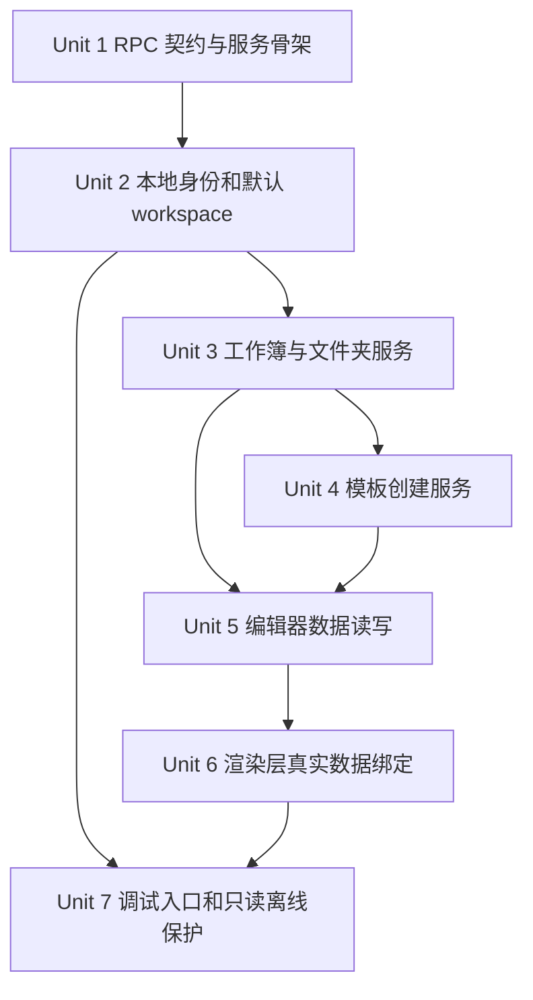
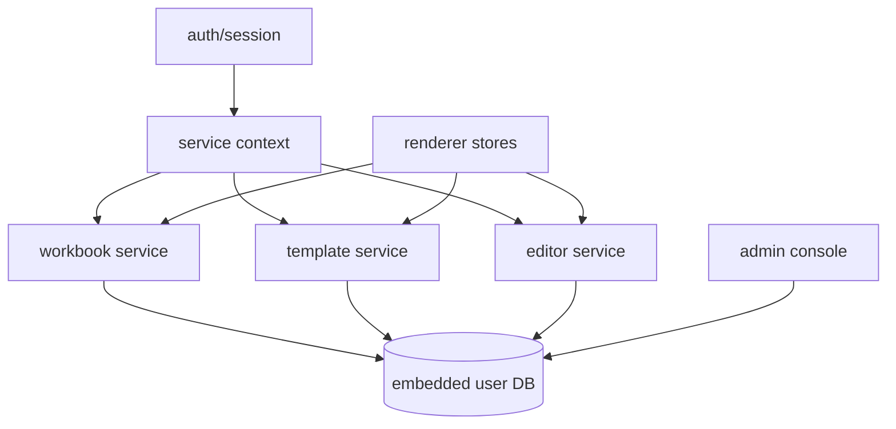

# feat: 打通产品核心可用闭环

## Overview

当前仓库已经完成 Electrobun / Bun / embedded SurrealDB / Svelte 5 / RevoGrid 的基础架构，并且多数页面交互已经存在。但产品仍不可用：渲染层页面主要读取 `src/renderer/lib/mock.ts`，主进程只暴露通用 `query` RPC，缺少稳定的应用服务 API、首个工作区/工作簿引导、模板创建、编辑器读写和页面状态绑定。

本计划的目标不是一次性实现全部产品功能，而是先打通第一个可用核心闭环：

登录或冷启动恢复用户上下文 -> 初始化本地用户与默认工作区 -> 展示真实工作簿列表 -> 从空白或模板创建工作簿 -> 打开编辑器加载真实 sheet/行数据 -> 新增、编辑、粘贴后持久化到 SurrealDB -> 回到首页仍能看到真实数据。

## Problem Frame

现状的主要断层：

- `src/main/index.ts` 只有 `query`、`getAuthState`、`logout` 三个 request RPC，渲染层没有面向产品操作的 typed API。
- `HomeScreen.svelte`、`MyDocsScreen.svelte`、`TemplatesScreen.svelte`、`AdminScreen.svelte`、`EditorScreen.svelte` 仍由 `src/renderer/lib/mock.ts` 驱动。
- `EditorScreen.svelte` 里的新增记录、粘贴、视图切换、右侧面板都只改内存数组，刷新或切页后数据丢失。
- `schema/main.surql` 已经定义 `workspace`、`workbook`、`folder`、`sheet`、`form_definition`、动态实体表模板等数据模型，但主进程还没有服务层把这些模型变成产品操作。
- embedded 本地 DB 不支持 record-level `authenticate()`，因此本地模式不能依赖 `DEFINE ACCESS` 自动创建 `app_user` / `workspace` 的副作用；需要 trusted main process 显式引导本地身份与默认工作区。

## Requirements Trace

- R1. 渲染层停止用 mock 数据驱动核心页面，首页、我的文档、模板创建和编辑器至少走真实 RPC + SurrealDB。
- R2. 主进程提供 typed、产品语义明确的 RPC，不再让普通页面提交任意 SurrealQL。
- R3. 登录或冷启动恢复后，本地用户 DB 内必须有 `app_user` 和至少一个默认 `workspace`。
- R4. 首页和我的文档能列出、搜索、打开真实 `workbook`，并能创建空白工作簿。
- R5. 模板页能从受控模板创建真实 `workbook`、`sheet`、动态实体表和初始数据。
- R6. 编辑器能按 `workbookId` 加载真实 sheets、列定义和行数据。
- R7. 编辑器新增记录、单元格编辑、Excel/TSV 粘贴应用后能持久化，刷新后数据仍存在。
- R8. 动态表名、record id、workspace/workbook/sheet id 必须在主进程受控生成或校验，不接受渲染层传入任意表名执行 DDL/DML。
- R9. 离线恢复状态下先保持只读核心浏览能力；写操作要被服务层拒绝并在 UI 反馈。
- R10. 保留 Admin Console 的调试价值，但不得作为核心产品页面的数据通道。

## Scope Boundaries

- 本阶段不实现 remote local-sync、冲突合并、pending sync 队列。
- 本阶段不实现多人协作、presence、mutation replay 的完整协同协议；只记录必要的本地 mutation/snapshot 钩子，为后续留接口。
- 本阶段不实现 Mastra AI 助手、自动生成 SurrealQL、自然语言操作数据库。
- 本阶段不实现真实文件上传、附件 bucket、Excel 文件导入解析；TSV 粘贴作为首个批量录入路径。
- 本阶段不完整实现公开表单、成员邀请、权限后台、关系图谱可视化；这些页面可以先接真实只读数据或保留明确的禁用状态。
- 本阶段不大改 UI 视觉设计，只替换数据来源、状态流和必要的空/错/加载反馈。

## Context & Research

### Relevant Code and Patterns

- `docs/plans/2026-04-22-001-feat-main-framework-scaffold-plan.md` 已完成主框架骨架，明确 RPC 类型共享、DB 单例、RevoGrid 更新需赋新数组引用。
- `docs/plans/2026-04-25-002-feat-local-first-dual-db-architecture-plan.md` 已完成 local-first 双数据库架构，`initEngine()`、`initUserDb()`、`tryRestoreSession()`、`token_store` 已落地。
- `docs/solutions/best-practices/surrealdb-embedded-local-first-session-isolation-2026-04-25.md` 记录 embedded SurrealDB 的关键约束：`newSession()` 共享 KV、schema 执行前必须 strip `USE`、`db.close()` 在当前栈下会 segfault。
- `src/main/db/index.ts` 已经封装本地 embedded engine、用户 DB、meta session 和 remote 连接，是后续服务层唯一 DB 入口。
- `src/main/index.ts` 当前 RPC 在同一文件内定义，适合先抽出 `src/main/rpc/handlers.ts` 或分领域注册函数，避免入口继续膨胀。
- `src/shared/rpc.types.ts` 是主进程与 WebView 的类型契约，应扩展为产品 API DTO 的单一来源。
- `schema/main.surql` 已定义核心表：`app_user`、`workspace`、`has_workspace_member`、`workbook`、`folder`、`sheet`、`edge_catalog`、`mutation`、`snapshot`、`form_definition`。
- `schema/templates/*.surql` 和 `schema/templates/ddl-*.sql` 已表达模板 provisioning 思路，但当前模板含占位符和动态 DDL 假设，实施前需要主进程模板服务统一校验与参数化。
- `src/renderer/features/grid/Grid.svelte` 已封装 RevoGrid 粘贴和编辑事件，可保留 UI 组件，改为接收动态 columns 与通用 row DTO。
- `src/renderer/App.svelte` 当前 `navigate(screen)` 没有参数，打开编辑器时无法携带 `workbookId`；需要最小路由状态对象。

### Institutional Learnings

- `docs/solutions/best-practices/surrealdb-embedded-local-first-session-isolation-2026-04-25.md` 的结论必须继承：本地用户 DB 与 `_meta` 分离、schema strip 头部、remote 失败静默降级、token 刷新写回。
- 项目 AGENTS 规则要求：SurrealQL 权限属于 schema，不在前端 query 中泄露 `WHERE user = $auth` 之类权限逻辑；系统结构关系用字段，业务关系实体用边；向 DB 传 record id 时使用 SDK RecordId / StringRecordId 类，而不是裸字符串。

### External References

- 未做外部研究。原因：本计划主要是在已有本地架构和 schema 上补应用服务层，仓库已有直接相关计划、实现和本地实测学习文档；外部资料对顶层路线的增益低于本地约束。

## Key Technical Decisions

- **先做 typed 应用服务 RPC，而不是继续开放 raw query。** 普通页面提交任意 SQL 会把权限、表名、DDL、数据校验和错误处理全部推到 WebView，既不可测试也不安全。产品页面只能调用 `listWorkbooks`、`createWorkbook`、`getWorkbookData`、`updateRows` 这类语义 API；`query` 仅保留给 Admin Console，并加 dev/admin guard。
- **本地身份引导由主进程服务显式完成。** embedded engine 不能依赖 record-level `authenticate()` 触发 `DEFINE ACCESS` 的 AUTHENTICATE 块。登录成功或恢复 session 后，主进程从 token claims 派生 `app_user`，用受控 record id 创建/更新用户与默认 workspace。
- **服务层以 workspace 为第一业务边界，并承担本地授权校验。** embedded trusted main process 可能绕过 record-level PERMISSIONS，因此所有 workbook、folder、sheet、动态实体表、form、edge_catalog 操作都先解析当前 app_user、workspace 与 role，再执行读写。渲染层只携带用户选择的 workbook/folder/template，不携带权限谓词；权限谓词仍属于 schema，服务层只做本地 trusted boundary 的等价校验。
- **模板 provisioning 先白名单化，不做任意模板执行器。** 首批模板来自 `schema/templates/` 的受控集合。动态表名由主进程生成 `ent_<workspaceKey>_<entityKey>` / `rel_<workspaceKey>_<relationKey>`，并在执行 DDL 前校验字符集和来源。
- **编辑器先持久化实体行值，协同布局日志轻量预留。** 当前核心价值是“表格 = 数据库表”能读写。`mutation` / `snapshot` 在本阶段只记录关键本地变更或保留插入点，不实现多人回放。
- **渲染层引入薄数据 store，不引入重型前端状态框架。** Svelte 5 runes 足够表达加载、错误、当前 workspace、workbook、sheet 和 rows；避免在第一闭环阶段引入额外依赖。
- **只读离线模式在主进程强制。** `auth.offlineMode` 只控制 UI 提示，服务层仍必须拒绝 create/update/delete，防止渲染层漏掉禁用状态造成本地写入。
- **测试分层按现有 Bun/NAPI 约束设计。** 纯 TypeScript 服务和 DTO 逻辑用 `bun test`；embedded SurrealDB 集成继续放在 `scripts/test-*.ts`；渲染层 store 优先保持为可在 Bun 下测试的纯 TS 状态逻辑，若实施中需要 DOM/Svelte 组件测试，再用 pnpm 显式引入 Vitest/Testing Library，而不是隐式依赖 `node_modules` 残留包。

## Open Questions

### Resolved During Planning

- **是否需要先完整规划所有功能？** 不需要。本计划聚焦核心可用闭环，协作、AI、同步、附件和表单后台后移。
- **是否继续让页面用 raw query 过渡？** 不作为产品路径。raw query 只留 Admin Console 调试，核心页面使用 typed RPC。
- **是否新增后端 HTTP 服务？** 不需要。Electrobun 不走 localhost HTTP；主进程到 WebView 继续使用 Electrobun RPC。
- **是否改 schema 的权限表达？** 本阶段不重写权限模型；主进程服务遵守既有 schema，把产品查询权限留在 schema / trusted service 边界，不在前端拼 auth 过滤。

### Deferred to Implementation

- **模板脚本里的占位符和动态 DDL 是否直接复用。** 实现时要验证 SurrealDB 对 `DEFINE TABLE IF NOT EXISTS $table_name`、`type::table()`、模板占位符的实际支持；如不稳定，改为 TypeScript 模板描述 + 受控 DDL 生成。
- **RevoGrid afteredit 事件能否精确拿到改动单元格。** 若当前事件只方便拿完整 source，本阶段可先做行级 diff；精确 cell patch 留后续优化。
- **离线恢复时是否允许本地写。** 现有产品文案说只读。本计划按只读实现；若产品之后决定 local-first 离线可写，需要单独规划 pending sync 和冲突策略。
- **Admin Console 的启用条件。** 实现时根据环境变量、构建 channel 或本地开发标记决定，计划只要求非普通产品入口。

## High-Level Technical Design

> *此图说明计划的方向，用于审阅整体边界，不是实现规格。实现时应按现有代码和测试反馈调整细节。*

## User Flows

- **Flow 1: 冷启动恢复并浏览文档。** 应用启动后 `tryRestoreSession()` 成功，主进程引导本地 user/workspace，渲染层加载 bootstrap，Home 显示真实最近 workbooks；如果没有 workbook，显示空状态和创建入口。
- **Flow 2: 创建空白工作簿。** 用户从 Home 或 MyDocs 点击空白文档，服务层在当前 workspace 创建 workbook、默认 sheet 和动态实体表，完成后导航到 Editor。
- **Flow 3: 从模板创建工作簿。** 用户进入 Templates，选择受控模板，服务层执行白名单 provisioning，成功后导航到 Editor；未知模板、离线只读或 provisioning 失败都返回明确错误态。
- **Flow 4: 编辑并持久化表格。** 用户打开 Editor，加载 active sheet 的 columns/rows，新增记录、编辑单元格或粘贴 TSV 后调用 `upsertRows`，成功后更新保存状态；刷新后重新读取仍能看到修改。
- **Flow 5: 离线只读恢复。** token 刷新失败但本地 DB 可恢复时，用户可以浏览已有 workspace/workbook/editor 数据；任何创建、模板、保存、删除操作都被服务层拒绝，UI 展示只读原因。

## Implementation Units

- [x] **Unit 1: 定义产品 RPC 契约与主进程服务骨架**

**Goal:** 从通用 `query` 过渡到 typed 产品 API，为后续功能提供稳定边界。

**Requirements:** R1, R2, R8, R10

**Dependencies:** 无

**Files:**
- Modify: `src/shared/rpc.types.ts`
- Modify: `src/main/index.ts`
- Create: `src/main/rpc/handlers.ts`
- Create: `src/main/services/context.ts`
- Create: `src/main/services/errors.ts`
- Create: `src/renderer/lib/app-api.ts`
- Test: `src/main/services/context.test.ts`

**Approach:**
- 在 `src/shared/rpc.types.ts` 中定义核心 DTO：`WorkspaceSummary`、`WorkbookSummary`、`FolderSummary`、`TemplateSummary`、`SheetSummary`、`GridColumnDef`、`GridRow`、`WorkbookData`、`MutationResult`。
- 新增产品 request：`getAppBootstrap`、`listWorkbooks`、`createBlankWorkbook`、`listTemplates`、`createWorkbookFromTemplate`、`getWorkbookData`、`upsertRows`、`deleteRows`。
- 将 `src/main/index.ts` 的 RPC handlers 抽到 `src/main/rpc/handlers.ts`，入口只负责初始化和注册。
- `src/main/services/context.ts` 统一解析当前用户 DB、offline 状态、当前本地用户 record id、默认 workspace；所有服务先拿 context。
- context 同时暴露 `assertCanReadWorkspace` / `assertCanWriteWorkspace` 一类本地授权检查，供服务层在 trusted embedded 访问前调用。
- `src/main/services/errors.ts` 定义可序列化错误码，例如 `NOT_AUTHENTICATED`、`OFFLINE_READ_ONLY`、`NOT_FOUND`、`VALIDATION_ERROR`。
- `src/renderer/lib/app-api.ts` 包装 RPC，负责把服务错误转为 UI 可展示错误，不在组件中散落 raw RPC 调用。
- 保留 `query` request，但标记为 Admin Console 专用；普通 store/API 不调用它。

**Patterns to follow:**
- `src/shared/rpc.types.ts` 现有 AppRPC 类型共享模式。
- `src/main/index.ts` 当前 `getAuthState` / `logout` / `startLogin` 的 Electrobun RPC 结构。

**Test scenarios:**
- Happy path: 未登录时调用只读启动 API 返回 auth 状态和空 app context，不抛无法序列化的 Error。
- Error path: 未登录时调用 `listWorkbooks` 返回 `NOT_AUTHENTICATED`。
- Error path: offline read-only context 下调用写 API 返回 `OFFLINE_READ_ONLY`。
- Edge case: 服务抛出普通 Error 时被规范化为可序列化错误，不泄露 stack 给渲染层。
- Integration: 当前用户不属于目标 workspace 时，服务层本地授权检查阻止访问，而不是依赖渲染层筛选。

**Verification:**
- 主进程入口不再直接承载所有业务 handler。
- 渲染层除 Admin Console 外没有新增 `rpc.request("query", ...)` 调用。

---

- [x] **Unit 2: 本地身份与默认 workspace 引导**

**Goal:** 登录或恢复后在用户专属 DB 中创建/更新本地 `app_user` 与默认 `workspace`，让业务页面有真实租户边界。

**Requirements:** R3, R8, R9

**Dependencies:** Unit 1

**Files:**
- Modify: `src/main/auth/session.ts`
- Modify: `src/main/db/index.ts`
- Create: `src/main/services/identity.ts`
- Test: `src/main/services/identity.test.ts`
- Test: `scripts/test-app-bootstrap.ts`

**Approach:**
- 将 token claims 解码结果扩展为 `sub`、`email`、`name`、`displayName`、`avatar`、`expiresAt`，避免服务层反复解析 JWT 字符串。
- `initUserDb` 和 `tryRestoreSession` 完成用户 DB 初始化后，调用 identity bootstrap。
- `identity.ts` 使用 SDK RecordId / StringRecordId 表达 `app_user:`，不把 record id 当普通字符串拼接传入数据库。
- `app_user.subject` 以 OIDC `sub` 为稳定唯一键；写入含唯一索引的记录时使用 SurrealDB 的 upsert / duplicate-key 语义处理重复登录。
- 默认 workspace 只在用户没有 owner workspace 时创建；workspace ownership 继续用 `workspace.owner` 字段，不新增边。若后续同步带来 shared workspace，本地 membership 仍通过 `has_workspace_member` 边表达。
- 本地服务以 trusted main process 身份执行引导，不把 `$auth` 权限逻辑搬到渲染层。

**Patterns to follow:**
- `schema/main.surql` 中 `DEFINE ACCESS madocs` 的用户与默认 workspace 创建逻辑，作为本地 embedded 模式的等价业务语义。
- `docs/solutions/best-practices/surrealdb-embedded-local-first-session-isolation-2026-04-25.md` 中的 token 持久化和用户 DB 恢复流程。

**Test scenarios:**
- Happy path: 新用户首次登录后创建一个 `app_user` 和一个默认 `workspace`，workspace.owner 指向该用户。
- Happy path: 同一用户再次登录不创建重复 workspace，只更新用户展示信息。
- Edge case: token 缺少 email 时仍能用 sub/name 创建本地用户和默认 workspace。
- Error path: 非法或缺失 sub 时引导失败，并返回 `VALIDATION_ERROR`。
- Integration: 冷启动 `tryRestoreSession()` 成功后，`getAppBootstrap` 能返回默认 workspace。

**Verification:**
- 真实用户 DB 中 `workspace` 不再为空。
- 首页进入时可以拿到当前 workspace，而不是依赖 mock workspace。

---

- [x] **Unit 3: 工作簿、文件夹与首页/我的文档数据服务**

**Goal:** 让首页和我的文档展示真实工作簿，并支持创建空白工作簿与基础文件夹浏览。

**Requirements:** R1, R4, R8, R9

**Dependencies:** Unit 2

**Files:**
- Create: `src/main/services/workbooks.ts`
- Create: `src/main/services/folders.ts`
- Modify: `src/shared/rpc.types.ts`
- Modify: `src/main/rpc/handlers.ts`
- Test: `src/main/services/workbooks.test.ts`
- Test: `src/main/services/folders.test.ts`
- Test: `scripts/test-workbook-flow.ts`

**Approach:**
- `listWorkbooks` 支持 workspace、folder、recent/mine/search 这些用户驱动筛选，但不在前端拼权限过滤。
- `listWorkbooks`、folder 读写和 workbook 创建都先调用 context 的 workspace 授权检查；用户驱动筛选只表达产品筛选，不表达安全边界。
- `createBlankWorkbook` 在当前 workspace 下创建 `workbook`，同时创建首个 `sheet` 和一个动态实体表；sheet.column_defs 使用最小默认列集合。
- folder 层先支持 list/create/rename 的服务能力，移动和树重排后续可加。
- workbook 的 `last_opened_sheet` 在打开或切换 sheet 时由服务层更新。
- DTO 统一输出用于 UI 的 `modifiedLabel` 或 `updatedAt`，避免页面继续依赖 mock 的中文时间字符串。

**Patterns to follow:**
- `schema/main.surql` 中 `workbook.folder` 用字段表达归属，folder parent 用字段表达层级。
- `schema/templates/blank-workspace.surql` 的空白 workspace 思路。

**Test scenarios:**
- Happy path: 默认 workspace 下创建空白工作簿后，`listWorkbooks` 能按最近列表返回该工作簿。
- Happy path: 创建 folder 后，在该 folder 下创建工作簿，`listWorkbooks(folderId)` 只返回该 folder 的工作簿。
- Edge case: search 为空时返回最近工作簿；search 有值时按名称或模板 key 过滤。
- Edge case: folderId 不属于当前 workspace 时返回 `NOT_FOUND` 或空结果，不跨 workspace 泄露数据。
- Error path: offline read-only 下创建工作簿被拒绝。
- Integration: 创建工作簿后同时存在 workbook、sheet、动态实体表，打开编辑器所需数据完整。

**Verification:**
- `HomeScreen.svelte` 和 `MyDocsScreen.svelte` 可以完全不读取 `workbooks`、`folders`、`folderDocs` mock。

---

- [x] **Unit 4: 受控模板目录与模板创建工作簿**

**Goal:** 让模板页从真实模板目录创建工作簿，并把模板中的 sheet、动态实体表、关系表和初始数据 provision 到当前 workspace。

**Requirements:** R1, R5, R8, R9

**Dependencies:** Unit 3

**Files:**
- Create: `src/main/services/templates.ts`
- Create: `src/main/templates/catalog.ts`
- Modify: `schema/templates/blank-workspace.surql`
- Modify: `schema/templates/case-management.surql`
- Modify: `schema/templates/legal-entity-tracker.surql`
- Modify: `schema/templates/ddl-entity-table.sql`
- Modify: `schema/templates/ddl-relation-table.sql`
- Modify: `src/shared/rpc.types.ts`
- Modify: `src/main/rpc/handlers.ts`
- Test: `src/main/services/templates.test.ts`
- Test: `scripts/test-template-provisioning.ts`

**Approach:**
- `catalog.ts` 定义模板白名单：`blank`、`case-management`、`legal-entity-tracker`，输出模板名称、描述、标签、默认实体和关系。
- 模板服务生成 `workspaceKey` / `workbookKey`，所有动态表名只由服务层按白名单 key 组合；拒绝渲染层传入 table name。
- DDL 执行分两步：先为实体表和关系表定义 schema/permissions/index，再执行 DML provisioning 创建 workbook、sheet、edge_catalog、form_definition 和初始行。
- 模板脚本里现有占位符要么替换为参数化执行可验证的形式，要么迁移为 TypeScript 模板描述生成受控 SurrealQL。
- 所有有唯一索引的模板元数据写入使用 upsert / duplicate-key 更新语义，保证重复执行幂等。
- 不假设 DDL 与 DML 可以被一个事务完整回滚。实现时先验证 SurrealDB 对 DEFINE 语句的事务行为；若 DDL 不能安全回滚，模板服务必须写入可检测的 provisioning 状态，并提供重试/补齐路径。

**Patterns to follow:**
- `schema/templates/case-management.surql` 和 `schema/templates/legal-entity-tracker.surql` 对 sheet、edge_catalog、sample data 的领域设计。
- 项目 SurrealDB 规则：系统结构关系用字段，业务关系实体且有属性/双向遍历需求时才用边。

**Test scenarios:**
- Happy path: 使用 `blank` 创建工作簿，只创建 workbook + 一个空 sheet + 动态实体表。
- Happy path: 使用 `case-management` 创建工作簿后，返回多个 sheets，且每个 sheet.table_name 对应的实体表可查询。
- Happy path: 使用 `legal-entity-tracker` 创建后，edge_catalog 中存在受控关系类型，关系表可通过 RELATE 写入。
- Edge case: 重复执行同一模板不会重复创建同名 sheet 或 edge_catalog 记录。
- Error path: 未知 templateKey 返回 `VALIDATION_ERROR`，不执行任何 DDL/DML。
- Error path: DDL 成功但后续 DML 失败时，下一次同模板创建或修复流程能检测 incomplete 状态并幂等补齐，而不是创建第二套动态表。
- Error path: offline read-only 下模板创建被拒绝。
- Integration: 模板创建完成后，`getWorkbookData(workbookId)` 能加载默认 sheet 的真实列和行。

**Verification:**
- `TemplatesScreen.svelte` 的模板列表和“使用此模板创建”来自真实 RPC。
- 创建后的 workbook 可从首页/我的文档打开。

---

- [x] **Unit 5: 编辑器真实数据读写闭环**

**Goal:** 让编辑器基于真实 workbook/sheet/dynamic table 加载列和行，并持久化新增、编辑、粘贴。

**Requirements:** R1, R6, R7, R8, R9

**Dependencies:** Unit 3、Unit 4

**Files:**
- Create: `src/main/services/editor.ts`
- Modify: `src/shared/rpc.types.ts`
- Modify: `src/main/rpc/handlers.ts`
- Modify: `src/renderer/features/grid/Grid.svelte`
- Modify: `src/renderer/screens/EditorScreen.svelte`
- Test: `src/main/services/editor.test.ts`
- Test: `scripts/test-editor-flow.ts`

**Approach:**
- `getWorkbookData(workbookId)` 返回 workbook 元数据、sheets、activeSheet、columns、rows；服务层验证 workbook 属于当前 workspace。
- `getWorkbookData` 和 `upsertRows` 都先通过 workbook -> workspace 解析本地授权，禁止仅凭 workbookId/sheetId 访问动态表。
- Grid columns 从 `sheet.column_defs` 映射为 RevoGrid columns，移除 `CreditorRow` 固定字段假设。
- row DTO 使用稳定 record id 和 `values` object；渲染层不接触动态 table name。
- `upsertRows` 接收 `sheetId` + rows patch，由服务层解析 sheet.table_name 并校验 column_defs，再写入对应动态实体表。
- 新增记录、单元格编辑、粘贴统一走 `upsertRows`；先允许行级批量保存，后续再优化为 cell-level patch。
- 写入成功后可插入轻量 `mutation` 记录，包含 workbook、client_id、command_id、params，用于后续协同基础；本阶段不回放 mutation。
- 右侧详情面板、看板、画廊先基于当前 sheet rows 派生，避免再读 mock changes。

**Patterns to follow:**
- `src/renderer/features/grid/Grid.svelte` 当前通过 `afterpasteapply` 取完整 source 并赋新数组引用的模式。
- `schema/main.surql` 中 `sheet.column_defs` 作为列定义唯一来源的设计。

**Test scenarios:**
- Happy path: 打开包含一个 sheet 的 workbook，返回 columns 和 rows，渲染层能展示表格。
- Happy path: 新增一行后调用 `getWorkbookData`，新行仍存在。
- Happy path: 编辑一个单元格后，只更新对应 row 的 values，不丢失其他字段。
- Happy path: 粘贴多行 TSV 后批量创建/更新多条实体记录。
- Edge case: sheetId 不属于 workbook 时返回 `NOT_FOUND`。
- Edge case: patch 包含 column_defs 未定义字段时返回 `VALIDATION_ERROR` 或忽略，行为必须在实现中固定并测试。
- Error path: 动态实体表不存在时返回明确错误，不让 UI 显示空白成功态。
- Error path: workbookId 属于其他 workspace 或当前用户无 membership 时返回 `NOT_FOUND` 或 `FORBIDDEN`，不返回部分元数据。
- Error path: offline read-only 下任何 upsert/delete 被拒绝。
- Integration: 模板创建的 workbook 能直接进入编辑器并保存数据。

**Verification:**
- 刷新应用或切到其他页面再回来，编辑器数据仍来自 DB 且保持上次写入结果。
- `EditorScreen.svelte` 不再调用 `createCreditorRows()`。

---

- [x] **Unit 6: 渲染层状态、导航参数与真实数据替换**

**Goal:** 用 Svelte 5 runes 建立最小应用数据层，把页面从 mock 数据切到真实 RPC。

**Requirements:** R1, R4, R5, R6, R7, R9

**Dependencies:** Unit 1、Unit 3、Unit 4、Unit 5

**Files:**
- Modify: `src/renderer/App.svelte`
- Create: `src/renderer/lib/app-state.svelte.ts`
- Create: `src/renderer/lib/workbooks.svelte.ts`
- Create: `src/renderer/lib/editor.svelte.ts`
- Modify: `src/renderer/lib/types.ts`
- Modify: `src/renderer/screens/HomeScreen.svelte`
- Modify: `src/renderer/screens/MyDocsScreen.svelte`
- Modify: `src/renderer/screens/TemplatesScreen.svelte`
- Modify: `src/renderer/screens/EditorScreen.svelte`
- Test: `src/renderer/lib/app-state.test.ts`
- Test: `src/renderer/lib/editor.test.ts`

**Approach:**
- 将 `navigate(screen)` 扩展为最小 route state，例如 screen + workbookId + folderId + templateKey；继续保留 localStorage 恢复，但校验参数。
- `app-state.svelte.ts` 负责启动时调用 `getAppBootstrap`，保存 auth、workspace、offline、全局错误。
- `workbooks.svelte.ts` 负责首页/我的文档列表加载、搜索、创建空白工作簿、从模板创建后导航到 editor。
- `editor.svelte.ts` 负责按 workbookId 加载、保存 rows、切换 sheet、保存状态提示。
- 页面组件只消费 store 状态和 action，尽量不直接调用 RPC。
- 删除或隔离 `src/renderer/lib/mock.ts` 的核心页面依赖；可保留为视觉开发 fixture，但不参与生产路径。
- 所有页面补齐加载、空状态、错误状态和 offline 禁用写按钮。
- store 测试优先覆盖纯状态转移和 RPC 适配；组件级交互截图/DOM 测试不作为本阶段阻塞项，除非实施中发现 store 测试无法覆盖关键路径。

**Patterns to follow:**
- `src/renderer/lib/auth.svelte.ts` 的 runes store 风格。
- `App.svelte` 当前 localStorage 恢复 screen 的保护性 try/catch。

**Test scenarios:**
- Happy path: 登录态启动后 app bootstrap 加载 workspace，Home 显示真实 workbooks。
- Happy path: 点击 workbook row 导航到 editor，并携带 workbookId。
- Happy path: 从模板创建成功后自动打开新 workbook。
- Edge case: localStorage 里有 editor 但缺 workbookId 时回退 Home。
- Edge case: listWorkbooks 返回空数组时显示空状态，而不是 mock 数据。
- Error path: RPC 返回 `NOT_AUTHENTICATED` 时回到登录态或显示会话失效。
- Error path: offline read-only 时创建和保存按钮 disabled，触发时也不会发写请求。

**Verification:**
- 核心页面不再引用 `workbooks`、`folderDocs`、`templates`、`createCreditorRows`。
- 用户完成“创建 -> 打开 -> 编辑 -> 返回列表 -> 再打开”的闭环。

---

- [x] **Unit 7: 调试入口、权限护栏与可验证状态**

**Goal:** 防止核心可用闭环被 raw query、离线写入、无提示失败和不可观测状态破坏。

**Requirements:** R2, R9, R10

**Dependencies:** Unit 1、Unit 6

**Files:**
- Modify: `src/main/rpc/handlers.ts`
- Modify: `src/renderer/screens/AdminConsoleScreen.svelte`
- Modify: `src/renderer/screens/StateScreen.svelte`
- Create: `src/main/services/audit.ts`
- Test: `src/main/rpc/handlers.test.ts`

**Approach:**
- `query` request 加 guard：仅开发 channel、显式环境变量或管理员调试模式可用；失败时返回明确错误。
- Admin Console 标明当前连接的是用户本地 DB，避免误以为是远端生产 DB；但不要把它作为普通用户入口。
- 服务层所有 write API 统一检查 offline read-only。
- 客户端错误通过现有 `client_error` 表预留入口记录关键错误；本阶段至少记录服务错误码、screen、workbookId。
- State 页面从真实错误/权限状态驱动，避免仍是孤立静态页面。

**Patterns to follow:**
- `src/renderer/screens/AdminConsoleScreen.svelte` 当前 query 调试体验。
- `schema/main.surql` 中 `client_error` 表的观测模型。

**Test scenarios:**
- Happy path: 开发 guard 开启时 Admin Console 可以执行 query。
- Error path: guard 关闭时 `query` 返回 `FORBIDDEN`。
- Error path: offline read-only 下所有 write request 统一拒绝。
- Integration: 渲染层收到服务错误后能进入对应 State 或组件错误态。

**Verification:**
- 普通产品路径没有 raw query 依赖。
- 离线模式下不会发生本地写入。

## System-Wide Impact

- **Interaction graph:** `src/main/index.ts` 从单文件 handler 入口变成 RPC 注册 + 服务层；`src/renderer/App.svelte` 从 screen 字符串导航变成带参数的最小 route state；核心 screens 将改为消费 stores。
- **Error propagation:** 主进程服务错误必须序列化为稳定错误码；渲染层 store 再映射为登录失效、只读离线、空状态或普通错误提示。
- **State lifecycle risks:** 创建 workbook/template 涉及多表写入和动态 DDL，必须以幂等步骤和失败回滚策略处理；至少要避免出现 workbook 已创建但 sheet/table 缺失后 UI 认为成功。
- **API surface parity:** Admin Console 可继续 raw query，但 Home/MyDocs/Templates/Editor 必须走 typed RPC。后续 PublicForm/Admin/AI 也应沿用同一服务层，而不是新开数据通道。
- **Integration coverage:** 单元测试不足以证明闭环，需要脚本级 embedded DB 集成验证：bootstrap、创建、模板、编辑保存、重新读取。
- **Unchanged invariants:** Electrobun RPC、不走 HTTP localhost、pnpm-only、local-first 双 DB、schema PERMISSIONS、系统关系用字段/业务关系用边这些既有架构不变。

## Risks & Dependencies

| Risk | Mitigation |
|------|------------|
| embedded 本地 DB 没有 record auth，schema 中依赖 `$auth` 的创建逻辑不会自动运行 | Unit 2 在 trusted main process 显式实现本地身份和默认 workspace 引导 |
| raw query 继续被产品页面使用，导致权限和数据校验外泄 | Unit 1 建 typed RPC，Unit 7 给 `query` 加 guard，渲染层只通过 `app-api.ts` 调服务 |
| 动态表名和模板 DDL 可能引入注入或跨 workspace 写入 | Unit 4 只允许服务层生成白名单表名，所有模板 key 和 entity key 校验后执行 |
| 模板创建一半失败留下破损 workbook | 不假设 DDL 可事务回滚；模板 provisioning 设计为幂等，实施时验证事务能力，无法事务化的 DDL/DML 组合要有可检测的 incomplete 状态和重试补齐路径 |
| RevoGrid 事件只给完整 source，保存大表时代价高 | 第一阶段可接受行级 diff；计划中保留后续 cell patch 优化，不阻塞可用闭环 |
| 离线只读文案与 local-first 用户预期冲突 | 本阶段按现有文案实现只读；离线可写需要 pending sync 专门规划 |
| 测试 runner 对 surrealdb-node NAPI 有限制 | 保留 `bun test` 做纯逻辑测试，DB 集成继续使用 `scripts/test-*.ts` 形式 |
| trusted main process 绕过 record-level PERMISSIONS 后遗漏授权校验 | `src/main/services/context.ts` 集中提供 workspace/role 校验，所有服务测试覆盖跨 workspace 和无 membership 场景 |

## Phased Delivery

### Phase 1: 服务边界和本地引导

- Unit 1 和 Unit 2。完成后用户 DB 中有真实 user/workspace，RPC 边界稳定。

### Phase 2: 文档列表和创建入口

- Unit 3 和 Unit 4。完成后 Home/MyDocs/Templates 能创建并打开真实 workbook。

### Phase 3: 编辑器读写闭环

- Unit 5 和 Unit 6。完成后核心“表格 = 数据库表”的用户路径可用。

### Phase 4: 护栏和可观测性

- Unit 7。收紧 raw query、离线写保护和错误状态，避免演示可用但实际不可控。

## Documentation / Operational Notes

- 更新 `TODOS.md` 或后续执行计划时，应以本计划的 Unit 顺序作为第一轮实施顺序。
- 如果模板脚本从 `.surql` 迁移为 TypeScript 描述，应在 `schema/templates/README.md` 记录模板作者需要遵守的表名、字段类型和关系规则。
- 新增 service DTO 后，应把 `src/shared/rpc.types.ts` 视为产品 API 契约；后续页面不能绕过它直接提交 SurrealQL。
- 不新增 `package-lock.json` 或 `yarn.lock`；如需要测试依赖，使用 pnpm。

## Success Metrics

- 首次登录后自动存在一个默认 workspace。
- 用户能创建空白 workbook，并在首页/我的文档看到它。
- 用户能从模板创建 workbook，并打开包含真实 sheets 和初始数据的编辑器。
- 用户在编辑器新增或修改至少一行，刷新后数据仍存在。
- 核心页面不再依赖 `src/renderer/lib/mock.ts`。
- 普通产品路径没有 raw query。

## Sources & References

- Existing plan: `docs/plans/2026-04-22-001-feat-main-framework-scaffold-plan.md`
- Existing plan: `docs/plans/2026-04-25-002-feat-local-first-dual-db-architecture-plan.md`
- Institutional learning: `docs/solutions/best-practices/surrealdb-embedded-local-first-session-isolation-2026-04-25.md`
- Schema: `schema/main.surql`
- Templates: `schema/templates/`
- Main process entry: `src/main/index.ts`
- DB lifecycle: `src/main/db/index.ts`
- RPC types: `src/shared/rpc.types.ts`
- Renderer mock source: `src/renderer/lib/mock.ts`
- Grid component: `src/renderer/features/grid/Grid.svelte`
