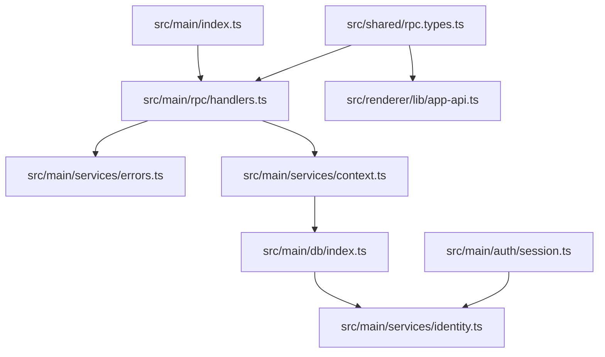

# feat: RPC 服务边界与本地身份引导

## Overview

这是 `docs/plans/2026-04-26-001-feat-functional-core-vertical-slice-plan.md` 的 Unit 1/2 执行子计划。目标是先建立后续产品功能都要依赖的最小后端边界：

1. 产品页面通过 typed RPC 访问主进程服务，不再新增 raw SurrealQL 通道。
2. 主进程有统一的 service context、错误码和 offline 写保护。
3. 登录或冷启动恢复后，本地用户 DB 中存在当前 `app_user` 和默认 `workspace`。
4. 这些能力有纯逻辑测试和 embedded DB 集成脚本验证。

## Problem Frame

当前 `src/main/index.ts` 直接内联 Electrobun RPC handlers，只有 `query`、`getAuthState`、`logout` 三个 request。`query` 对 Admin Console 有用，但不能作为产品页面的数据通道。与此同时，embedded 本地 DB 不能依赖 remote record auth 的 `DEFINE ACCESS` 副作用创建用户和 workspace，所以后续 `listWorkbooks`、`createWorkbook`、`getWorkbookData` 都会缺少可信的本地业务上下文。

本子计划先补这一层，不实现工作簿列表、模板创建或编辑器读写。

## Requirements Trace

- R1. 普通产品 API 必须走 typed RPC；`query` 只保留为调试入口。
- R2. RPC handlers 从 `src/main/index.ts` 抽离，入口文件只负责初始化、窗口和事件绑定。
- R3. 所有服务通过统一 context 获取当前 DB、auth state、offline state、当前 user 和默认 workspace。
- R4. 写操作在 offline read-only 状态下由主进程拒绝。
- R5. 登录成功后创建/更新本地 `app_user`，并在缺少 owner workspace 时创建默认 `workspace`。
- R6. 冷启动恢复成功后执行同样的本地 identity bootstrap。
- R7. record id、workspace id 等数据库 ID 在服务层使用 SurrealDB SDK RecordId / StringRecordId 或等价类型处理，不把裸字符串当 record link 传入数据库。
- R8. 错误返回稳定、可序列化，不把主进程 stack 或原始 DB 错误直接暴露给渲染层。

## Scope Boundaries

- 不实现 `listWorkbooks`、`createBlankWorkbook`、`listTemplates`、`createWorkbookFromTemplate`、`getWorkbookData`、`upsertRows` 的真实业务逻辑；本阶段只定义契约占位和错误边界。
- 不改 `schema/main.surql` 的权限模型。
- 不实现 remote sync、pending sync、离线可写或冲突合并。
- 不改核心页面数据来源；渲染层只新增 `app-api.ts` 包装，为后续 Unit 6 使用。
- 不给 Admin Console 做完整权限系统；只保留后续 Unit 7 收紧 guard 的接入点。

## Context & Research

### Relevant Code and Patterns

- `src/main/index.ts` 当前内联 `BrowserView.defineRPC<AppRPC>`，可直接抽离到 `src/main/rpc/handlers.ts`。
- `src/shared/rpc.types.ts` 需要区分 legacy scaffold 消息、auth state、raw query 调试入口和产品 DTO，避免后续业务 API 使用 `unknown`。
- `src/main/db/index.ts` 已有 `initEngine()`、`initUserDb()`、`tryRestoreSession()`、`getLocalDb()`、`closeUserDb()`，是 identity bootstrap 的挂接点。
- `src/main/auth/session.ts` 当前只保存 `_expiresAt`，需要补充 token claims 的解析/传递边界，但仍应避免重新持久化完整 token 到内存。
- `schema/main.surql` 的 `DEFINE ACCESS madocs` 已表达 remote auth 后创建 `app_user` 和默认 `workspace` 的语义；本地 embedded 模式需要在主进程服务中显式复刻这段业务结果。
- `docs/solutions/best-practices/surrealdb-embedded-local-first-session-isolation-2026-04-25.md` 已确认 schema 执行、token_store、db.close 和 session 恢复约束。

### Institutional Learnings

- embedded 用户 DB 初始化后必须 strip schema header，不能让 `USE NS main DB docs` 把 schema 写到错误 DB。
- token 刷新后必须写回 `token_store:local`，本子计划不能破坏现有 session 恢复逻辑。
- 权限谓词属于 schema；渲染层不能拼 `$auth` 过滤。由于本地 trusted main process 可能绕过 record PERMISSIONS，service context 要做本地 workspace/role 校验。

### External References

- 未做外部研究。子计划完全基于当前仓库实现和已记录的 SurrealDB 本地学习。

## Key Technical Decisions

- **先建立窄服务骨架，再补业务服务。** Unit 1/2 的输出是可被 Unit 3+ 复用的 RPC、context、errors、identity，不提前实现工作簿业务。
- **错误响应使用 discriminated union。** 每个产品 request 返回成功 payload 或统一 `AppError`，避免 Electrobun 传递原始 Error 时前端难以分类。
- **context 是唯一授权入口。** 后续服务不得直接调用 `getLocalDb()` 后读写业务表；必须先通过 context 解析 user/workspace/offline，并调用读写断言。
- **identity bootstrap 接在 DB 生命周期后，而不是 UI bootstrap 中。** `initUserDb()` 和 `tryRestoreSession()` 成功切到用户 DB 并加载 schema 后，主进程立即保证 user/workspace 存在，避免渲染层首次请求拿到半初始化状态。
- **本地 user id 派生规则要集中。** OIDC `sub` 到 `app_user` record id 的映射放在 identity 服务里，避免 main、db、session 各自解码和拼接。

## Open Questions

### Resolved During Planning

- **是否此阶段就实现工作簿列表？** 不实现。只返回 bootstrap 所需的当前 workspace/user 摘要；工作簿服务进入后续子计划。
- **是否在渲染层保存 token claims？** 不保存。claims 只在主进程用于本地 identity bootstrap，渲染层最多拿 user/workspace 摘要。
- **是否依赖 schema 的 `DEFINE ACCESS` 本地自动建用户？** 不依赖。embedded 本地 DB 以 trusted 主进程显式执行等价引导。

### Deferred to Implementation

- **`StringRecordId` 在当前 `surrealdb@2.0.3` 的具体 import 名称和序列化行为。** 实现时以本地 SDK 类型为准，计划只要求不要把 record link 当普通 string 传给 DB。
- **默认 workspace slug 的冲突策略。** 先由 identity 服务集中生成并用唯一冲突更新/重试处理；具体 slug 格式可在实现时按 schema 约束确定。
- **offline 状态持久化位置。** 当前可由恢复结果和内存 auth state 派生；如后续需要跨模块查询，可在 context 中缓存，不要求写入 DB。

## High-Level Technical Design

> *此图说明计划的方向，用于审阅整体边界，不是实现规格。实现时应按现有代码和测试反馈调整细节。*

## Implementation Units

- [x] **Unit A: 扩展共享 RPC 契约与错误模型**

**Goal:** 为产品 API 建立 typed contract 和稳定错误分类。

**Requirements:** R1, R3, R4, R8

**Dependencies:** 无

**Files:**
- Modify: `src/shared/rpc.types.ts`
- Create: `src/main/services/errors.ts`
- Create: `src/renderer/lib/app-api.ts`
- Test: `src/main/services/errors.test.ts`

**Approach:**
- 在 `src/shared/rpc.types.ts` 中新增 `AppErrorCode`、`AppError`、`Result<T>` 或等价响应结构。
- 扩展 bootstrap DTO：`CurrentUserDTO`、`WorkspaceDTO`、`AppBootstrap`，并补充 `RecordIdString` / `ISODateTimeString` 等传输基础类型。
- 先声明后续产品 request 的类型占位，但业务 handler 可以在 Unit B 中返回 `NOT_IMPLEMENTED`，避免前端后续再改契约。
- `src/main/services/errors.ts` 负责把未知异常、DB 异常、验证错误映射为稳定 `AppError`。
- `src/renderer/lib/app-api.ts` 封装 `rpc.request`，提供 `getAppBootstrap` 等方法；组件后续只依赖这个薄 API。

**Patterns to follow:**
- `src/shared/rpc.types.ts` 现有 `AppRPC extends ElectrobunRPCSchema` 写法。
- `src/renderer/lib/rpc.ts` 现有 Electroview RPC 初始化。

**Test scenarios:**
- Happy path: `toAppResult(payload)` 返回 success 结构，payload 类型保持。
- Error path: 普通 Error 被映射为 `INTERNAL_ERROR`，不包含 stack。
- Error path: 已知 service error 保留原始 code 和 message。
- Edge case: 空 message 的错误返回默认用户可读 message。

**Verification:**
- `src/shared/rpc.types.ts` 能表达 bootstrap 和后续产品 request 的请求/响应类型。
- 渲染层新增 API wrapper，但核心页面还不需要接入。

---

- [x] **Unit B: 抽离 RPC handlers 并建立 service context**

**Goal:** 把主进程 RPC 入口从 `src/main/index.ts` 中抽出，并让所有产品 request 经过统一 context。

**Requirements:** R1, R2, R3, R4, R8

**Dependencies:** Unit A

**Files:**
- Modify: `src/main/index.ts`
- Create: `src/main/rpc/handlers.ts`
- Create: `src/main/services/context.ts`
- Test: `src/main/services/context.test.ts`
- Test: `src/main/rpc/handlers.test.ts`

**Approach:**
- `src/main/rpc/handlers.ts` 导出创建 RPC handler 配置的函数，接收发送 `authStateChanged` 所需的回调或 rpc facade，避免循环引用。
- `src/main/index.ts` 保留 `initEngine()`、`initMastra()`、`BrowserWindow`、`dom-ready` 和 `startLogin` wiring，业务 request 迁移出去。
- `context.ts` 暴露 `getServiceContext()`，返回当前 local DB、auth/offline 状态、当前 user id、默认 workspace 摘要。
- `context.ts` 暴露 `assertAuthenticated()`、`assertWritable()`、`assertCanReadWorkspace()`、`assertCanWriteWorkspace()`。
- 当前阶段 `getAppBootstrap` 是唯一真实产品 request：未登录返回 auth state + 空 context；已登录返回 user/workspace 摘要；offline 返回 read-only 标记。
- 后续产品 request 可先接入 handler 并返回 `NOT_IMPLEMENTED`，但必须已经经过 `assertAuthenticated` / `assertWritable` 的边界设计。

**Patterns to follow:**
- `src/main/index.ts` 当前 `logout` 会 `clearSession()` + `closeUserDb()` + push auth state。
- `src/main/db/index.ts` 当前 `getLocalDb()` 未登录时 throw，context 应捕获并转成 `NOT_AUTHENTICATED`。

**Test scenarios:**
- Happy path: 未登录 `getAppBootstrap` 返回 `loggedIn: false`，不调用 `getLocalDb()` 导致 raw throw。
- Happy path: 已登录 context 返回 user/workspace 摘要。
- Error path: `assertWritable()` 在 offline read-only 时返回 `OFFLINE_READ_ONLY`。
- Error path: 未登录调用需要认证的占位 request 返回 `NOT_AUTHENTICATED`。
- Edge case: context 读取 workspace 为空时返回 `BOOTSTRAP_REQUIRED` 或触发 identity bootstrap，行为固定并测试。

**Verification:**
- `src/main/index.ts` 不再内联大段 request handler。
- raw `query` 仍可用于 Admin Console，但不被 `app-api.ts` 包装为普通产品 API。

---

- [x] **Unit C: 解码 token claims 并实现本地 identity bootstrap**

**Goal:** 登录和恢复 session 后，本地用户 DB 始终有当前 `app_user` 和默认 `workspace`。

**Requirements:** R5, R6, R7

**Dependencies:** Unit A、Unit B

**Files:**
- Modify: `src/main/db/index.ts`
- Modify: `src/main/auth/session.ts`
- Create: `src/main/services/identity.ts`
- Test: `src/main/services/identity.test.ts`
- Test: `scripts/test-app-bootstrap.ts`

**Approach:**
- `identity.ts` 定义 `TokenClaims` 和 `decodeTokenClaims()`，集中处理 JWT payload 的 `sub`、email、name、preferred_username、picture、expiresAt。
- `initUserDb(sub, tokens)` 可演进为接收 claims 或在内部调用 identity decode，但最终只有一个地方负责 sub -> local user identity 的映射。
- `tryRestoreSession()` 使用现有 token_store 恢复成功后，也调用 identity bootstrap；如果只有仍有效 access_token，也要能从 access token 解 claims。
- `bootstrapLocalIdentity(claims)` 创建/更新 `app_user`，再查询 owner workspace；没有时创建默认 workspace。
- 对有唯一约束的 `app_user.subject`、`workspace.slug` 写入，使用 SurrealDB upsert / duplicate-key 更新语义或集中重试策略。
- identity 服务返回 `CurrentUserDTO` 和默认 `WorkspaceDTO`，供 context/bootstrap 复用。

**Patterns to follow:**
- `schema/main.surql` 中 `DEFINE ACCESS madocs` 的 display name、email、avatar 和默认 workspace 语义。
- `src/main/db/index.ts` 现有 `initUserDb` 在 schema load 后写 `token_store` 和 `_meta.last_user_db` 的顺序。

**Test scenarios:**
- Happy path: 新 claims 首次 bootstrap 创建 user 和 workspace。
- Happy path: 同一 claims 再次 bootstrap 更新 user，不重复创建 workspace。
- Happy path: claims 缺少 email 时仍创建 user/workspace。
- Edge case: claims 缺少 sub 时返回 `VALIDATION_ERROR`。
- Edge case: workspace slug 冲突时不会破坏已有 workspace，最终返回当前用户可用 workspace。
- Integration: `scripts/test-app-bootstrap.ts` 使用 embedded DB 初始化用户 DB 后，执行 identity bootstrap，再读取 app_user/workspace 验证关系。

**Verification:**
- 登录成功路径和冷启动恢复路径都调用同一 identity bootstrap。
- `getAppBootstrap` 在已登录状态下能稳定返回 user/workspace。

---

- [x] **Unit D: 验证脚本与回归护栏**

**Goal:** 给 Unit 1/2 的关键边界建立最小可重复验证，防止后续 Unit 3+ 在半初始化状态上继续堆功能。

**Requirements:** R3, R4, R5, R6, R8

**Dependencies:** Unit A、Unit B、Unit C

**Files:**
- Modify: `package.json`
- Create: `scripts/test-app-bootstrap.ts`
- Test: `src/main/services/errors.test.ts`
- Test: `src/main/services/context.test.ts`
- Test: `src/main/services/identity.test.ts`

**Approach:**
- 如果需要新增脚本命令，只使用 `pnpm` 维护 package metadata，不引入 npm/yarn lockfile。
- `bun test src/main` 覆盖纯逻辑：errors、claims decode、context guard。
- `scripts/test-app-bootstrap.ts` 覆盖 embedded DB 集成：init engine/user DB、bootstrap identity、读取默认 workspace、重复 bootstrap 幂等。
- 集成脚本继续遵守现有 NAPI 约束：不依赖 `bun test` runner，不调用 `db.close()`。

**Patterns to follow:**
- `scripts/test-db.ts` 和 `scripts/verify-multi-session.ts` 的脚本式集成验证方式。
- `src/main/db/index.test.ts` 当前只放不会触发 NAPI worker 的轻量测试。

**Test scenarios:**
- Happy path: 集成脚本首次 bootstrap 通过。
- Happy path: 集成脚本重复 bootstrap 后 workspace 数量不重复增长。
- Error path: offline writable guard 在纯逻辑测试中拒绝写 request。
- Error path: 未认证 context 在纯逻辑测试中返回 `NOT_AUTHENTICATED`。

**Verification:**
- Unit 1/2 完成后，实施者能先跑纯逻辑测试，再跑 embedded bootstrap 脚本，确认服务边界和本地身份都可用。

## System-Wide Impact

- **Interaction graph:** `src/main/index.ts` 变薄；RPC handler、context、identity 成为后续所有业务服务的入口。
- **Error propagation:** 产品 request 不再依赖 Electrobun 原始 Error 传播；渲染层能按错误码区分未登录、只读离线、未实现和内部错误。
- **State lifecycle risks:** 登录成功和冷启动恢复都必须触发 identity bootstrap，否则后续页面会看到登录态但没有 workspace。
- **API surface parity:** Admin Console 的 raw query 保留，但不进入 `app-api.ts`；后续业务页面默认只能走 typed API。
- **Unchanged invariants:** local-first 双 DB、token_store、schema strip、pnpm-only、不走 localhost HTTP 不变。

## Risks & Mitigations

| Risk | Mitigation |
|------|------------|
| handler 抽离引入 rpc 循环引用 | `handlers.ts` 接收最小 callback/facade，不直接 import window 实例 |
| 本地 identity bootstrap 与 remote `DEFINE ACCESS` 语义漂移 | `identity.ts` 明确以 `schema/main.surql` 的 AUTHENTICATE 逻辑为模式，并覆盖 display/email/default workspace 测试 |
| trusted main process 遗漏 workspace 授权 | `context.ts` 集中断言，后续服务必须依赖 context；Unit B 测试跨 workspace guard |
| token claims 解码散落多个模块 | sub、email、display name 派生集中到 `identity.ts`，`src/main/index.ts` 移除局部 `decodeJwtSub` |
| 集成测试触发 surrealdb-node NAPI runner 问题 | embedded 验证继续用 `scripts/test-app-bootstrap.ts`，不放进 `bun test` runner |

## Documentation / Operational Notes

- Unit 1/2 完成后，顶层计划的 Unit 3 才应开始落 `workbooks.ts` / `folders.ts`。
- 新增 shared RPC 类型时要保持 repo-relative import，不把 main-only 类型泄漏到 renderer。
- 若实现发现 `RecordId` / `StringRecordId` API 与计划描述不同，更新本子计划的 Deferred 条目或在执行总结中记录实际 SDK 类型。

## Success Metrics

- `src/main/index.ts` 只保留初始化、窗口、dom-ready、login/logout wiring，业务 request 在 `src/main/rpc/handlers.ts`。
- `getAppBootstrap` 可在未登录、已登录、offline 三种状态返回稳定结构。
- 登录成功和冷启动恢复成功后，本地 DB 有当前 `app_user` 和默认 `workspace`。
- 重复 bootstrap 不创建重复默认 workspace。
- 普通产品 API wrapper 不暴露 raw `query`。

## Sources & References

- Origin plan: `docs/plans/2026-04-26-001-feat-functional-core-vertical-slice-plan.md`
- DB lifecycle: `src/main/db/index.ts`
- Main process entry: `src/main/index.ts`
- Session state: `src/main/auth/session.ts`
- RPC contract: `src/shared/rpc.types.ts`
- Schema auth/bootstrap semantics: `schema/main.surql`
- Existing DB integration script: `scripts/test-db.ts`
- Embedded DB learning: `docs/solutions/best-practices/surrealdb-embedded-local-first-session-isolation-2026-04-25.md`
