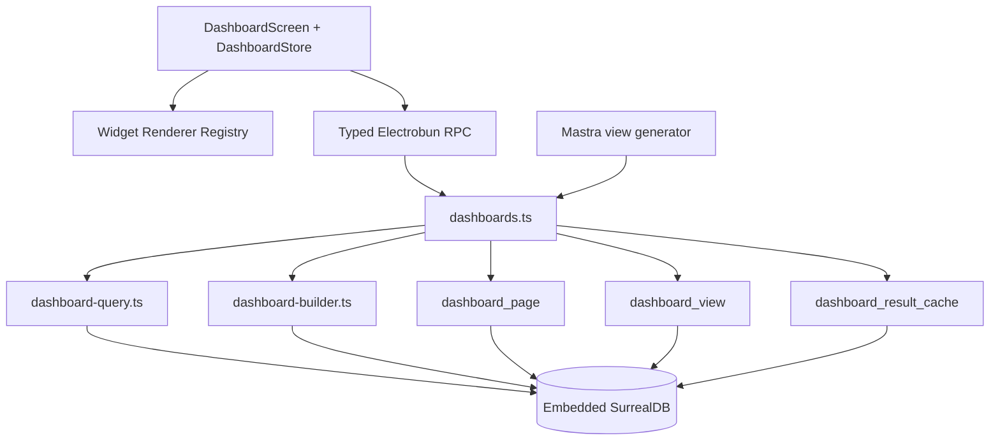
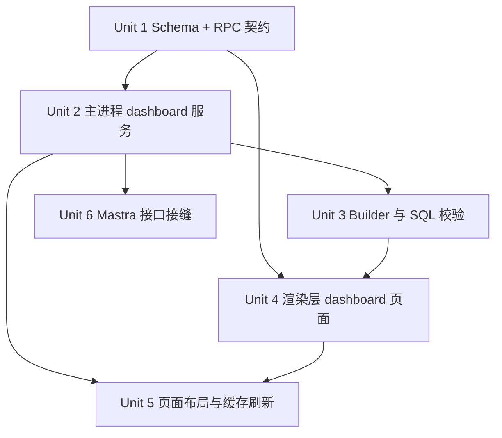

# feat: 本地 SQL 仪表盘与 Mastra 视图注册

## Overview

本计划为项目新增一套独立于 `workbook/sheet` 编辑器的数据仪表盘能力。核心目标是把“统计视图”产品化为可持久化、可复用、可由 Mastra 自动生成的本地资源：

- 每个统计视图本质上是一条只读的 SurrealQL 查询定义。
- 页面不直接绑定 SQL 字符串，而是绑定 `dashboard_view` 记录。
- 用户默认通过预制 Builder 创建视图，不直接手写 SQL。
- 用户可在高级模式切换到代码模式编辑 SQL。
- Mastra 后续只需要生成受控的视图定义并写入视图表，页面即可自动展示新视图。

本功能遵循现有架构约束：

- Electrobun 仅走主进程 RPC，不引入 localhost HTTP。
- 仪表盘查询统一在 Bun 主进程执行。
- SurrealDB 元数据通过 schema 管理，前端不直接提交 raw query 作为产品 API。
- 视图页面复用现有 Svelte 5 “注册表 + 动态组件”模式（参见 `src/renderer/features/editor/registries/views.ts`）。

## Problem Frame

当前仓库已经有三类能力，但尚未形成“仪表盘产品闭环”：

- 主进程已有本地 SurrealDB、typed RPC 和编辑器服务层，可稳定读写业务实体表。
- 渲染层已有按注册表动态切换视图的成熟模式，适合承载不同 widget 渲染器。
- Admin Console 已可执行本地 SQL，但它只是调试入口，不是可持久化、可配置、可复用的业务能力。

缺失点在于：

- 没有“页面”和“统计视图”的持久化模型。
- 没有“预制 Builder -> 受控 SQL -> 结果契约 -> 组件渲染”的稳定链路。
- 没有把高级 SQL 模式限制为只读统计查询。
- 没有面向 Mastra 的统一视图保存接口。
- 没有缓存与刷新机制，无法支撑后续远程同步到本地后的稳定展示。

如果直接让页面保存任意 SQL 字符串并立即执行，会带来三个问题：

- 视图与布局耦合，不能复用同一统计视图到多个页面。
- 前端必须自己猜测 SQL 结果结构，Mastra 生成结果不稳定。
- 后续无法在统一入口上做校验、缓存、日志、刷新和 DSL 升级。

## Requirements Trace

- R1. 用户可以创建独立的仪表盘页面，并在页面中放置多个统计 widget。
- R2. 每个 widget 绑定到一个持久化的 `dashboard_view`，而不是内联 SQL。
- R3. 默认交互模式是预制 Builder；用户不默认手写 SQL。
- R4. 用户可通过高级选项切换到 SQL 模式编辑视图。
- R5. SQL 模式允许查询本地数据库任意表，不额外注入权限过滤。
- R6. 视图 SQL 必须是只读统计查询，不能成为 DDL/DML 入口。
- R7. 主进程必须在保存和预览时校验 SQL、结果 shape 和视图配置。
- R8. 前端 widget 渲染器只消费标准化结果契约，不直接消费任意 query result。
- R9. Mastra 后续可通过统一服务生成并保存 `dashboard_view`，无需直接操作页面布局。
- R10. 页面应优先展示缓存结果，再按策略刷新，避免每次打开都重新跑所有查询。
- R11. 仪表盘属于工作区级资源，应保留 `workspace` 归属，便于后续多页面、多成员和远程同步。
- R12. 第一阶段不引入新的重型图表依赖；优先用现有栈和轻量自绘组件落地。

## Scope Boundaries

- 本阶段不做跨设备 dashboard 同步协议，只设计本地模型和后续同步接缝。
- 本阶段不做自然语言对话式“临时问答查询”界面，只做持久化仪表盘视图。
- 本阶段不做完整拖拽式自由布局编辑器；先做受控网格布局和持久化尺寸/位置。
- 本阶段不把仪表盘结果回写到业务表，不支持“点图即写库”的交互式分析。
- 本阶段不做复杂多页 drill-down 路由系统；页面内跳转先限于打开工作簿/筛选后的页面。
- 本阶段不开放任意 raw query 给普通页面；高级模式仍然走受控仪表盘 API。

## Context & Research

### Relevant Repo Patterns

- `src/main/services/editor.ts` 已有受控查询拼装与 DTO 映射模式，适合复用“主进程执行查询、前端只拿标准 DTO”的边界。
- `src/main/rpc/handlers.ts` 已形成 typed RPC 入口，新增 dashboard API 应沿用相同分层。
- `src/shared/rpc.types.ts` 是所有产品 RPC 的唯一契约源，dashboard DTO 应在此集中定义。
- `src/renderer/App.svelte` 和 `src/renderer/lib/types.ts` 已有轻量路由状态；新增 `dashboard` screen 成本低。
- `src/renderer/features/editor/registries/views.ts` 与 `src/renderer/screens/EditorScreen.svelte` 已证明“注册表 + 动态组件”适合承载可扩展视图。
- `schema/main.surql` 中 `form_definition` 与 `edge_catalog` 已展示“稳定字段强类型 + 变化快配置字段用 `TYPE any`”的建模方式，适合复制到 dashboard 元数据。
- `src/main/db/index.ts` 已统一持有 embedded SurrealDB 和 schema 装载流程，dashboard schema 直接增补到 `schema/main.surql` 即可。

### Institutional Learnings

- `docs/solutions/best-practices/surrealdb-embedded-local-first-session-isolation-2026-04-25.md` 要求 schema 继续通过统一 schema 文件装载，不在运行时拼接分散 DDL。
- `docs/solutions/best-practices/svelte-screen-modular-refactor-with-registry-pattern-2026-04-28.md` 明确建议“同构平行选项走注册表”，适用于 dashboard widget renderer、builder 模板和页面操作菜单。
- 项目 AGENTS 规则要求：
  - 权限属于 schema，不属于前端查询。
  - 系统结构关系优先用字段而不是边。
  - 传给 SurrealDB 的 record id 必须使用 `RecordId` 或 `StringRecordId`。

### External Research

- 未做外部研究。原因：本计划主要是沿用仓库现有 Bun + Electrobun + SurrealDB + Svelte 模式扩展新资源类型，不依赖新的外部平台协议或高风险第三方 API。

## Key Technical Decisions

- **仪表盘模型独立于 `workbook/sheet`。** `sheet` 是实体表编辑入口，dashboard 是统计视图与展示入口，两者复用数据源但不复用资源模型。
- **页面与视图拆分为两个一等实体。** `dashboard_page` 负责布局；`dashboard_view` 负责统计定义。同一视图可在多个页面复用。
- **SQL 可查询本地任意表，但必须只读。** 这是产品语义限制，不是权限限制。仪表盘视图不能承担数据修改职责。
- **默认入口是 Builder，不是 SQL 编辑器。** Builder 输出结构化 `builder_spec`，由主进程编译成 `compiled_sql`。
- **高级模式并不绕过校验。** SQL 模式仍要走统一的 `validate -> preview -> save` 管道。
- **视图必须声明 `view_type` 与 `result_contract`。** 组件不猜 SQL 结果结构；主进程在预览和刷新时校验结果是否符合契约。
- **第一阶段不引入图表库。** KPI、表格、分类柱图、时间序列图用 HTML/SVG 自绘组件实现，避免新依赖与样式体系冲突。
- **页面先读缓存再刷新。** `dashboard_result_cache` 是页面首屏的默认数据源；刷新策略独立于页面布局。
- **Mastra 不直写数据库。** 它通过主进程统一的 view save API 提交 `builder_spec` 或 `compiled_sql`，复用同一校验与缓存流程。

## High-Level Technical Design



## Data Model

### 1. `dashboard_page`

页面资源，代表一个可导航的仪表盘页面。

稳定字段：

- `workspace: record<workspace>`
- `title: string`
- `slug: string`
- `description: option<string>`
- `created_at: datetime`
- `updated_at: datetime`

灵活字段：

- `widgets: any`

`widgets[]` 每项建议结构：

```ts
type DashboardWidgetLayout = {
  id: string;
  viewId: RecordIdString;
  titleOverride?: string;
  grid: { x: number; y: number; w: number; h: number };
  displayOverride?: Record<string, unknown>;
  refreshPolicyOverride?: "inherit" | "manual" | "on_open_if_stale" | "interval";
};
```

建模原因：

- 布局是系统结构关系，不是业务关系实体，用字段数组而不是 relation table。
- widget 不单独建表，避免创建/删除页面时产生大量小记录和多次查询。

建议索引：

- `workspace + slug UNIQUE`
- `workspace`

建议权限：

- 沿用 `workspace` 级资源模式，权限写在 schema。
- 查询执行本身不注入 auth 过滤，但页面元数据仍按 workspace 归属管理。

### 2. `dashboard_view`

统计视图资源，代表一个可复用的查询定义。

稳定字段：

- `workspace: record<workspace>`
- `title: string`
- `slug: string`
- `description: option<string>`
- `query_mode: string`，枚举 `["preset", "builder", "sql"]`
- `view_type: string`，枚举 `["kpi", "table", "bar", "line"]`
- `result_contract: string`，枚举 `["single_value", "category_breakdown", "time_series", "table_rows"]`
- `compiled_sql: string`
- `status: string`，枚举 `["draft", "active", "invalid"]`
- `version: int`
- `created_by: option<record<app_user>>`
- `last_run_at: option<datetime>`
- `created_at: datetime`
- `updated_at: datetime`

灵活字段：

- `builder_spec: any`
- `display_spec: any`
- `source_tables: any`
- `dependencies: any`

字段说明：

- `builder_spec` 是 Builder/ Mastra 的结构化输入。
- `compiled_sql` 是最终执行 SQL。
- `display_spec` 存单位、格式化、调色、排序、图例等渲染参数。
- `source_tables` 存用户声明或系统提取的表名数组。
- `dependencies` 预留到字段级依赖与未来同步脏标记。

建议索引：

- `workspace + slug UNIQUE`
- `workspace + status`
- `workspace`

### 3. `dashboard_result_cache`

每个视图最近一次执行结果缓存。

稳定字段：

- `view: record<dashboard_view>`
- `status: string`，枚举 `["ok", "error", "stale", "running"]`
- `rows_count: int`
- `duration_ms: int`
- `executed_at: datetime`
- `sql_hash: string`

灵活字段：

- `result_json: any`
- `result_meta: any`
- `error_detail: any`

建模方式：

- 对 `view` 建唯一索引，一个视图只有一条最新缓存。
- 刷新时对固定 id 或唯一索引执行 `UPSERT ... ON DUPLICATE KEY UPDATE`。

### 4. `dashboard_run_log`（可选但建议）

记录执行历史，便于调试高级 SQL 和 Mastra 生成结果。

- `view: record<dashboard_view>`
- `status`
- `duration_ms`
- `executed_at`
- `sql_hash`
- `result_meta`
- `error_detail`

第一阶段可只定义 schema，不必立即接入 UI。

## Directional Schema Additions

以下为设计方向，不是要求原样拷贝的实现代码。

```surql
DEFINE TABLE IF NOT EXISTS dashboard_page SCHEMAFULL
  PERMISSIONS
    FOR select WHERE
      workspace.owner = $auth
      OR workspace IN $auth<-has_workspace_member<-workspace,
    FOR create, update, delete WHERE
      workspace.owner = $auth;
DEFINE FIELD IF NOT EXISTS workspace   ON TABLE dashboard_page TYPE record<workspace>;
DEFINE FIELD IF NOT EXISTS title       ON TABLE dashboard_page TYPE string;
DEFINE FIELD IF NOT EXISTS slug        ON TABLE dashboard_page TYPE string;
DEFINE FIELD IF NOT EXISTS description ON TABLE dashboard_page TYPE option<string>;
REMOVE FIELD IF EXISTS widgets.* ON TABLE dashboard_page;
DEFINE FIELD OVERWRITE widgets         ON TABLE dashboard_page TYPE any DEFAULT [];
DEFINE FIELD IF NOT EXISTS created_at  ON TABLE dashboard_page TYPE datetime VALUE time::now();
DEFINE FIELD IF NOT EXISTS updated_at  ON TABLE dashboard_page TYPE datetime VALUE time::now();
DEFINE INDEX IF NOT EXISTS dashboard_page_ws_slug_unique
  ON TABLE dashboard_page COLUMNS workspace, slug UNIQUE;

DEFINE TABLE IF NOT EXISTS dashboard_view SCHEMAFULL
  PERMISSIONS
    FOR select WHERE
      workspace.owner = $auth
      OR workspace IN $auth<-has_workspace_member<-workspace,
    FOR create, update, delete WHERE
      workspace.owner = $auth;
DEFINE FIELD IF NOT EXISTS workspace       ON TABLE dashboard_view TYPE record<workspace>;
DEFINE FIELD IF NOT EXISTS title           ON TABLE dashboard_view TYPE string;
DEFINE FIELD IF NOT EXISTS slug            ON TABLE dashboard_view TYPE string;
DEFINE FIELD IF NOT EXISTS description     ON TABLE dashboard_view TYPE option<string>;
DEFINE FIELD IF NOT EXISTS query_mode      ON TABLE dashboard_view TYPE string ASSERT $value INSIDE ["preset", "builder", "sql"];
DEFINE FIELD IF NOT EXISTS view_type       ON TABLE dashboard_view TYPE string ASSERT $value INSIDE ["kpi", "table", "bar", "line"];
DEFINE FIELD IF NOT EXISTS result_contract ON TABLE dashboard_view TYPE string ASSERT $value INSIDE ["single_value", "category_breakdown", "time_series", "table_rows"];
DEFINE FIELD IF NOT EXISTS compiled_sql    ON TABLE dashboard_view TYPE string;
DEFINE FIELD IF NOT EXISTS status          ON TABLE dashboard_view TYPE string ASSERT $value INSIDE ["draft", "active", "invalid"];
DEFINE FIELD IF NOT EXISTS version         ON TABLE dashboard_view TYPE int DEFAULT 1;
DEFINE FIELD IF NOT EXISTS created_by      ON TABLE dashboard_view TYPE option<record<app_user>>;
DEFINE FIELD IF NOT EXISTS last_run_at     ON TABLE dashboard_view TYPE option<datetime>;
REMOVE FIELD IF EXISTS builder_spec.* ON TABLE dashboard_view;
REMOVE FIELD IF EXISTS display_spec.* ON TABLE dashboard_view;
REMOVE FIELD IF EXISTS source_tables.* ON TABLE dashboard_view;
REMOVE FIELD IF EXISTS dependencies.* ON TABLE dashboard_view;
DEFINE FIELD OVERWRITE builder_spec        ON TABLE dashboard_view TYPE any DEFAULT {};
DEFINE FIELD OVERWRITE display_spec        ON TABLE dashboard_view TYPE any DEFAULT {};
DEFINE FIELD OVERWRITE source_tables       ON TABLE dashboard_view TYPE any DEFAULT [];
DEFINE FIELD OVERWRITE dependencies        ON TABLE dashboard_view TYPE any DEFAULT [];
DEFINE FIELD IF NOT EXISTS created_at      ON TABLE dashboard_view TYPE datetime VALUE time::now();
DEFINE FIELD IF NOT EXISTS updated_at      ON TABLE dashboard_view TYPE datetime VALUE time::now();
DEFINE INDEX IF NOT EXISTS dashboard_view_ws_slug_unique
  ON TABLE dashboard_view COLUMNS workspace, slug UNIQUE;

DEFINE TABLE IF NOT EXISTS dashboard_result_cache SCHEMAFULL
  PERMISSIONS
    FOR select WHERE
      view.workspace.owner = $auth
      OR view.workspace IN $auth<-has_workspace_member<-workspace,
    FOR create, update, delete WHERE
      view.workspace.owner = $auth;
DEFINE FIELD IF NOT EXISTS view         ON TABLE dashboard_result_cache TYPE record<dashboard_view>;
DEFINE FIELD IF NOT EXISTS status       ON TABLE dashboard_result_cache TYPE string ASSERT $value INSIDE ["ok", "error", "stale", "running"];
DEFINE FIELD IF NOT EXISTS rows_count   ON TABLE dashboard_result_cache TYPE int DEFAULT 0;
DEFINE FIELD IF NOT EXISTS duration_ms  ON TABLE dashboard_result_cache TYPE int DEFAULT 0;
DEFINE FIELD IF NOT EXISTS sql_hash     ON TABLE dashboard_result_cache TYPE string;
DEFINE FIELD IF NOT EXISTS executed_at  ON TABLE dashboard_result_cache TYPE datetime VALUE time::now();
REMOVE FIELD IF EXISTS result_json.* ON TABLE dashboard_result_cache;
REMOVE FIELD IF EXISTS result_meta.* ON TABLE dashboard_result_cache;
REMOVE FIELD IF EXISTS error_detail.* ON TABLE dashboard_result_cache;
DEFINE FIELD OVERWRITE result_json    ON TABLE dashboard_result_cache TYPE any DEFAULT null;
DEFINE FIELD OVERWRITE result_meta    ON TABLE dashboard_result_cache TYPE any DEFAULT {};
DEFINE FIELD OVERWRITE error_detail   ON TABLE dashboard_result_cache TYPE any DEFAULT null;
DEFINE INDEX IF NOT EXISTS dashboard_result_cache_view_unique
  ON TABLE dashboard_result_cache COLUMNS view UNIQUE;
```

## Query Execution Design

### Supported Query Modes

- `preset`
  - 系统内置的固定模板。
  - 不允许用户改 SQL。
  - 适合“总数”“分组计数”“时间趋势”“Top N”。

- `builder`
  - 用户配置结构化参数。
  - 主进程编译出 `compiled_sql`。
  - 是默认模式。

- `sql`
  - 高级代码模式。
  - 用户直接编辑 SQL。
  - 仍需通过统一校验、预览和保存。

### Read-Only Validation

SQL 可以查询本地任意表，但服务层要阻止其变成写操作入口。

`dashboard-query.ts` 建议负责：

- 去除注释与字符串字面量后做保守关键字扫描。
- 仅允许单语句。
- 允许以 `SELECT` 或 `RETURN` 开头。
- 拒绝以下关键字：
  - `DEFINE`
  - `REMOVE`
  - `CREATE`
  - `UPDATE`
  - `UPSERT`
  - `DELETE`
  - `RELATE`
  - `INSERT`
  - `LIVE`
  - `USE`
  - `LET`
  - `BEGIN`
  - `COMMIT`
  - `CANCEL`
- 对 `table_rows`、`category_breakdown`、`time_series` 这类“行集型 contract”，要求 query 本身或编译器结果带行数上限。
- Builder 生成 SQL 一律自带 limit；高级 SQL 模式在保存时强制校验这一点。

### Result Contract

前端组件不直接消费任意 SQL 结果，统一消费标准 shape。

`single_value`

```ts
type SingleValueResult = {
  value: number | string | null;
  label?: string;
  unit?: string;
  delta?: number | null;
};
```

`category_breakdown`

```ts
type CategoryBreakdownResult = {
  rows: Array<{ key: string; label: string; value: number }>;
};
```

`time_series`

```ts
type TimeSeriesResult = {
  rows: Array<{ x: string; y: number; series?: string }>;
};
```

`table_rows`

```ts
type TableRowsResult = {
  columns: Array<{ key: string; label: string }>;
  rows: Array<Record<string, unknown>>;
};
```

主进程在预览和刷新时：

- 运行 query。
- 把 SurrealDB 原始结果归一化。
- 根据 `result_contract` 做 shape 校验。
- 不符合则返回 `VALIDATION_ERROR`，并把 view 标记为 `invalid` 或保留 draft。

## Builder Design

Builder 不实现为通用 SQL 可视化拼接器，而实现为“少数高价值统计模板 + 结构化参数”。

第一阶段模板：

- 记录总数
- 某字段去重数
- 按枚举字段分组计数
- 按日期字段做日/周/月趋势
- 某数值字段求和/平均/最大/最小
- Top N 排行榜

建议 `builder_spec`：

```ts
type DashboardBuilderSpec = {
  sourceTables: string[];
  baseTable: string;
  metric: {
    op: "count" | "count_distinct" | "sum" | "avg" | "min" | "max";
    field?: string;
  };
  dimensions?: Array<{
    field: string;
    bucket?: "day" | "week" | "month" | "year";
  }>;
  filters?: Array<{
    field: string;
    op: "eq" | "neq" | "gt" | "gte" | "lt" | "lte" | "contains" | "in" | "is_null" | "is_not_null";
    value?: unknown;
  }>;
  sort?: { field: string; direction: "asc" | "desc" };
  limit?: number;
};
```

`dashboard-builder.ts` 负责：

- 校验字段和操作组合是否合法。
- 编译出 `compiled_sql`。
- 推断 `result_contract` 与默认 `view_type`。
- 提取 `source_tables` 和初始 `dependencies`。

## RPC Contract Design

新增 DTO 建议放入 `src/shared/rpc.types.ts`。

核心 DTO：

- `DashboardPageSummaryDTO`
- `DashboardPageDTO`
- `DashboardWidgetDTO`
- `DashboardViewSummaryDTO`
- `DashboardViewDTO`
- `DashboardViewDraftDTO`
- `DashboardPreviewResponse`
- `DashboardCacheDTO`

新增 request：

- `listDashboardPages`
- `getDashboardPage`
- `createDashboardPage`
- `updateDashboardPage`
- `saveDashboardPageLayout`
- `listDashboardViews`
- `createDashboardView`
- `updateDashboardView`
- `previewDashboardView`
- `refreshDashboardPage`
- `refreshDashboardView`

典型返回：

- `getDashboardPage`
  - page
  - views
  - caches
- `previewDashboardView`
  - normalized result
  - duration
  - derived metadata
  - validation warnings

## Main Process Module Boundaries

### `src/main/services/dashboards.ts`

职责：

- 页面 CRUD
- 视图 CRUD
- page + view + cache 聚合读取
- 统一 save 流程编排

关键函数建议：

- `listDashboardPages(req)`
- `getDashboardPage(req)`
- `createDashboardPage(req)`
- `updateDashboardPage(req)`
- `saveDashboardPageLayout(req)`
- `createDashboardView(req)`
- `updateDashboardView(req)`
- `refreshDashboardView(req)`
- `refreshDashboardPage(req)`

### `src/main/services/dashboard-query.ts`

职责：

- 只读 SQL 校验
- 依赖表提取
- 结果执行与归一化
- contract 校验
- sql hash 计算

关键函数建议：

- `validateReadOnlyDashboardSql(sql, contract)`
- `extractSourceTables(sql)`
- `runDashboardPreview(definition)`
- `normalizeDashboardResult(raw, contract, displaySpec)`

### `src/main/services/dashboard-builder.ts`

职责：

- Builder spec 校验
- Builder -> SQL 编译
- 默认 `view_type`、`result_contract` 推断

关键函数建议：

- `validateBuilderSpec(spec)`
- `compileDashboardBuilder(spec)`
- `inferDefaultDisplaySpec(spec, contract)`

### `src/main/services/dashboard-mastra.ts`（可在第二阶段创建）

职责：

- 给 Mastra 的受控入口
- 读取 schema 摘要
- 保存模型生成的 dashboard view

## Renderer Architecture

### 路由

在 `src/renderer/lib/types.ts` 中新增：

- `ScreenId` 增加 `"dashboard"`
- `RouteState` 增加 `dashboardPageId?: string`

在 `src/renderer/App.svelte` 中：

- 把 `dashboard` 加入导航 screen 集合。
- 新增 `DashboardScreen.svelte` 分支。

### 页面结构

建议新增：

- `src/renderer/screens/DashboardScreen.svelte`
- `src/renderer/lib/dashboards.svelte.ts`
- `src/renderer/features/dashboard/`

目录建议：

```text
src/renderer/features/dashboard/
├── DashboardToolbar.svelte
├── DashboardCanvas.svelte
├── DashboardSidebar.svelte
├── DashboardWidgetFrame.svelte
├── DashboardEditorDrawer.svelte
├── lib/
│   ├── dashboard-ui.svelte.ts
│   └── dashboard-format.ts
├── registries/
│   ├── widgets.ts
│   └── builder-templates.ts
└── widgets/
    ├── KpiWidget.svelte
    ├── TableWidget.svelte
    ├── CategoryBarWidget.svelte
    └── TimeSeriesWidget.svelte
```

### Widget Renderer Registry

沿用 editor 的 registry 模式：

```ts
type DashboardWidgetRegistration = {
  viewType: "kpi" | "table" | "bar" | "line";
  component: Component;
};
```

这样：

- 新增视图类型时不改容器。
- Mastra 生成 `view_type` 后页面可以直接渲染。

### 布局策略

第一阶段不做自由拖拽布局编辑器。

采用：

- 12 列 CSS Grid
- `widgets[].grid = { x, y, w, h }`
- 页面渲染按 grid 坐标定位
- 编辑器先提供“移动/缩放/删除”按钮操作

这样可以先稳定落库与恢复布局，后续再补拖拽交互，不影响 schema 和 API。

## Refresh and Cache Strategy

刷新策略枚举：

- `manual`
- `on_open_if_stale`
- `interval`

第一阶段默认行为：

- 页面打开先读取 `dashboard_result_cache`
- 若 cache 不存在：
  - 显示空态
  - 自动后台刷新一次
- 若 cache 存在但过期：
  - 先渲染 cache
  - 后台刷新

`stale` 判定建议：

- `manual`：永不过期，直到手动刷新
- `on_open_if_stale`：超过 5 分钟过期
- `interval`：超过配置间隔过期

后续接远程同步时：

- 同步层只负责把受影响表标记为 dirty
- page open / manual refresh 再触发实际 query

## Mastra Integration Design

Mastra 不直接拼接页面布局，而只负责生成 `dashboard_view` 草案。

建议模型输出结构：

```ts
type GeneratedDashboardView = {
  title: string;
  description?: string;
  queryMode: "builder" | "sql";
  viewType: "kpi" | "table" | "bar" | "line";
  resultContract: "single_value" | "category_breakdown" | "time_series" | "table_rows";
  builderSpec?: DashboardBuilderSpec;
  compiledSql?: string;
  displaySpec?: Record<string, unknown>;
  rationale?: string;
};
```

保存流程：

1. Mastra 读取本地 schema 摘要或表清单。
2. 优先输出 `builderSpec`。
3. Builder 不足时输出 `compiledSql`。
4. 主进程调用统一 save API。
5. 服务层执行与 UI 相同的校验、预览与缓存。

这样 Mastra 与手工创建走同一条产品链路，不会产生两套定义标准。

## Implementation Units



- [ ] **Unit 1: Schema 与 RPC 契约落地**

**Goal:** 定义 dashboard 基础资源模型和 typed API。

**Requirements:** R1, R2, R8, R11

**Dependencies:** 无

**Files:**
- Modify: `schema/main.surql`
- Modify: `src/shared/rpc.types.ts`
- Modify: `src/main/rpc/handlers.ts`
- Modify: `src/renderer/lib/app-api.ts`
- Test: `src/main/services/dashboard-types.test.ts`

**Approach:**
- 在 schema 中新增 `dashboard_page`、`dashboard_view`、`dashboard_result_cache`。
- 在 RPC 类型中定义 page/view/cache DTO 与 request/response。
- 在 handlers 中注册 dashboard requests。
- 在 `app-api.ts` 增加 dashboard API 包装。

**Test scenarios:**
- Happy path: DTO 能完整表达 page + widgets + views + cache 聚合结果。
- Error path: 非法 `view_type` / `result_contract` 请求在进入 DB 前被拒绝。
- Edge case: 空 widgets 页面与无 cache 视图都能序列化返回。

---

- [ ] **Unit 2: 主进程 page/view 服务层**

**Goal:** 建立 dashboard 页面、视图、缓存的主进程服务边界。

**Requirements:** R1, R2, R7, R10, R11

**Dependencies:** Unit 1

**Files:**
- Create: `src/main/services/dashboards.ts`
- Create: `src/main/services/dashboards.test.ts`
- Modify: `src/main/services/context.ts`

**Approach:**
- `dashboard_page` 用 workspace 归属管理。
- `getDashboardPage` 一次性返回 page、所需 views 和最新 cache。
- `saveDashboardPageLayout` 只更新 widgets 数组和 `updated_at`。
- `refreshDashboardView` 统一写入 `dashboard_result_cache`。

**Test scenarios:**
- Happy path: 创建页面后可读取空 widgets 页。
- Happy path: 一个页面引用多个 view 时，可一次聚合返回所有 cache。
- Error path: 页面引用不存在的 viewId 时返回 `NOT_FOUND`。
- Edge case: cache 缺失时页面仍可渲染，状态为“待刷新”。

---

- [ ] **Unit 3: Builder 编译与高级 SQL 校验**

**Goal:** 把默认 Builder 和高级 SQL 模式统一到一个受控保存流程。

**Requirements:** R3, R4, R5, R6, R7, R8

**Dependencies:** Unit 2

**Files:**
- Create: `src/main/services/dashboard-builder.ts`
- Create: `src/main/services/dashboard-query.ts`
- Create: `src/main/services/dashboard-builder.test.ts`
- Create: `src/main/services/dashboard-query.test.ts`

**Approach:**
- Builder 负责模板编译和默认 display spec 推断。
- SQL validator 负责只读校验、单语句校验、limit 约束和依赖表提取。
- Preview API 在保存前执行并返回标准结果契约。

**Test scenarios:**
- Happy path: “按状态分组计数” builder 可编译为 `category_breakdown` 结果。
- Happy path: `single_value` contract 的 SQL 预览可返回标准 shape。
- Error path: 包含 `UPDATE` / `DELETE` / `DEFINE` 的 SQL 被拒绝。
- Error path: `table_rows` contract 的 SQL 不带 limit 时保存失败。
- Edge case: SQL 查询任意本地表但仍通过只读校验。
- Edge case: 结果 shape 与 `result_contract` 不匹配时返回 `VALIDATION_ERROR`。

---

- [ ] **Unit 4: 仪表盘页面与 widget 渲染器**

**Goal:** 提供可导航的 dashboard 页面和基础 widget 渲染。

**Requirements:** R1, R2, R8, R10, R12

**Dependencies:** Unit 1, Unit 2, Unit 3

**Files:**
- Modify: `src/renderer/lib/types.ts`
- Modify: `src/renderer/App.svelte`
- Modify: `src/renderer/components/SideNav.svelte`
- Create: `src/renderer/screens/DashboardScreen.svelte`
- Create: `src/renderer/lib/dashboards.svelte.ts`
- Create: `src/renderer/features/dashboard/registries/widgets.ts`
- Create: `src/renderer/features/dashboard/widgets/KpiWidget.svelte`
- Create: `src/renderer/features/dashboard/widgets/TableWidget.svelte`
- Create: `src/renderer/features/dashboard/widgets/CategoryBarWidget.svelte`
- Create: `src/renderer/features/dashboard/widgets/TimeSeriesWidget.svelte`
- Test: `src/renderer/lib/dashboards.test.ts`

**Approach:**
- 增加 `dashboard` route 和侧边导航入口。
- 页面加载时拉取当前 page + views + caches。
- 组件按 `view_type` 走 registry 动态渲染。
- chart 组件第一阶段用 HTML/SVG 自绘，不新增图表依赖。

**Test scenarios:**
- Happy path: 页面能根据 `view_type` 正确匹配组件。
- Happy path: cache 有值时页面首屏直接展示结果。
- Error path: 未知 `view_type` 展示明确 empty/error state。
- Edge case: 无 widgets 页面展示“添加首个视图”空态。

---

- [ ] **Unit 5: 页面编辑、布局与刷新**

**Goal:** 让页面可以添加 widget、编辑视图、保存布局并按策略刷新。

**Requirements:** R1, R3, R4, R7, R10

**Dependencies:** Unit 2, Unit 3, Unit 4

**Files:**
- Create: `src/renderer/features/dashboard/DashboardToolbar.svelte`
- Create: `src/renderer/features/dashboard/DashboardCanvas.svelte`
- Create: `src/renderer/features/dashboard/DashboardEditorDrawer.svelte`
- Create: `src/renderer/features/dashboard/lib/dashboard-ui.svelte.ts`
- Create: `src/renderer/features/dashboard/registries/builder-templates.ts`
- Modify: `src/renderer/screens/DashboardScreen.svelte`

**Approach:**
- Builder drawer 提供预制模板和高级模式切换。
- 页面先支持按钮式布局编辑，不强依赖拖拽。
- 提供“预览后保存”流程。
- 提供单 widget 刷新与整页刷新。

**Test scenarios:**
- Happy path: Builder 创建视图后可加入当前页面。
- Happy path: 高级模式预览成功后保存，页面立即可见。
- Error path: 预览失败时不允许保存。
- Edge case: 修改布局但未刷新数据时，仍显示旧 cache 且不丢结果。

---

- [ ] **Unit 6: Mastra 接缝**

**Goal:** 为后续 AI 自动新增仪表盘视图提供统一入口。

**Requirements:** R9

**Dependencies:** Unit 2, Unit 3

**Files:**
- Modify: `src/main/ai/index.ts`
- Create: `src/main/services/dashboard-mastra.ts`
- Create: `src/main/services/dashboard-mastra.test.ts`

**Approach:**
- 暴露“列出本地表摘要”“创建 dashboard view draft”“保存 dashboard view”三类受控操作。
- Mastra 不操作 page 布局；页面自行把新 view 添加为 widget。

**Test scenarios:**
- Happy path: Mastra 生成 builderSpec 并成功保存 view。
- Happy path: Mastra 生成 SQL 但仍通过只读与 contract 校验。
- Error path: Mastra 生成不合法 SQL 时被服务层拒绝，不污染现有页面。

## Test Strategy

主进程：

- `bun test src/main/services`
- 优先覆盖 builder、validator、service 聚合与 DTO 归一化。

渲染层：

- store 测试优先放在纯 TS 的 `*.test.ts`。
- widget 组件保持 dumb renderer，减少 DOM 测试复杂度。

集成验证：

- 用本地 embedded DB 创建若干 workbook/sheet/实体表样本数据。
- 创建 dashboard page / view。
- 运行 preview / refresh。
- 确认页面能读取 cache 并渲染。

## Risks and Mitigations

- **风险：高级 SQL 结果过于自由，导致渲染不稳定。**
  - 通过 `result_contract` 和服务端 shape 校验收敛输出。

- **风险：SQL 虽只读但结果集过大，页面卡顿。**
  - Builder 默认带 limit，高级模式对行集型 contract 强制 limit。

- **风险：未来接 Mastra 后生成结果飘忽。**
  - 要求 Mastra 走统一 save API，不允许旁路写表。

- **风险：没有图表库导致组件开发量上升。**
  - 第一阶段只支持 KPI、表格、柱图、折线图四类基础组件，保持 SVG 渲染简单。

- **风险：页面布局编辑复杂度膨胀。**
  - 第一阶段使用持久化网格坐标和按钮式调整，拖拽交互后置。

## Open Questions

### Resolved During Planning

- **是否允许查询任意本地表？** 允许。查询层不再额外考虑权限过滤。
- **是否应把 dashboard 建在 workbook 下面？** 不应。dashboard 是工作区级统计资源。
- **是否应默认开放 SQL 编辑器？** 不应。默认入口仍是 Builder，高级模式显式切换。
- **是否需要图表库？** 第一阶段不需要，先用自绘基础图形。

### Deferred to Implementation

- 是否在 `dashboard_view` 上增加 `favorite/pinned` 等首页管理字段。
- 是否在第一阶段就接入 `dashboard_run_log` UI。
- 是否在 Builder 中支持跨表 join 风格统计，还是先限制单表聚合。
- 是否要在页面层支持从 widget 点击跳转到某个 workbook/sheet 过滤视图。
